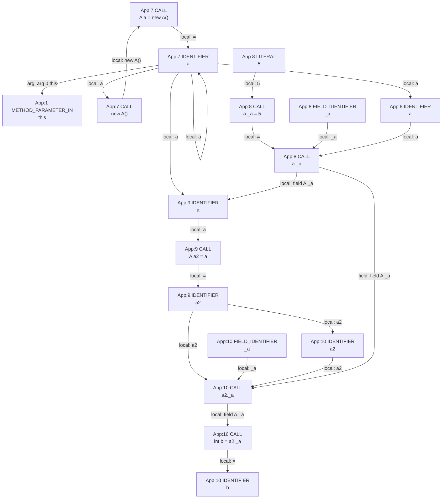

# ls: spike value graph

```mermaid
flowchart TD
  n0["App:1 METHOD_PARAMETER_IN<br/>this"]
  n1["App:10 CALL<br/>a2._a"]
  n2["App:10 CALL<br/>int b = a2._a"]
  n3["App:10 FIELD_IDENTIFIER<br/>_a"]
  n4["App:10 IDENTIFIER<br/>a2"]
  n5["App:10 IDENTIFIER<br/>b"]
  n6["App:7 CALL<br/>A a = new A()"]
  n7["App:7 CALL<br/>new A()"]
  n8["App:7 IDENTIFIER<br/>a"]
  n9["App:8 CALL<br/>a._a"]
  n10["App:8 CALL<br/>a._a = 5"]
  n11["App:8 FIELD_IDENTIFIER<br/>_a"]
  n12["App:8 IDENTIFIER<br/>a"]
  n13["App:8 LITERAL<br/>5"]
  n14["App:9 CALL<br/>A a2 = a"]
  n15["App:9 IDENTIFIER<br/>a"]
  n16["App:9 IDENTIFIER<br/>a2"]
  n1 -->|"local: field A._a"| n2
  n10 -->|"local: ="| n9
  n11 -->|"local: _a"| n9
  n12 -->|"local: a"| n9
  n13 -->|"local: 5"| n10
  n14 -->|"local: ="| n16
  n15 -->|"local: a"| n14
  n16 -->|"local: a2"| n1
  n16 -->|"local: a2"| n4
  n2 -->|"local: ="| n5
  n3 -->|"local: _a"| n1
  n4 -->|"local: a2"| n1
  n6 -->|"local: ="| n8
  n7 -->|"local: new A()"| n6
  n8 -->|"arg: arg 0 this"| n0
  n8 -->|"local: a"| n12
  n8 -->|"local: a"| n15
  n8 -->|"local: a"| n7
  n8 -->|"local: a"| n8
  n9 -->|"field: field A._a"| n1
  n9 -->|"local: field A._a"| n15
```
