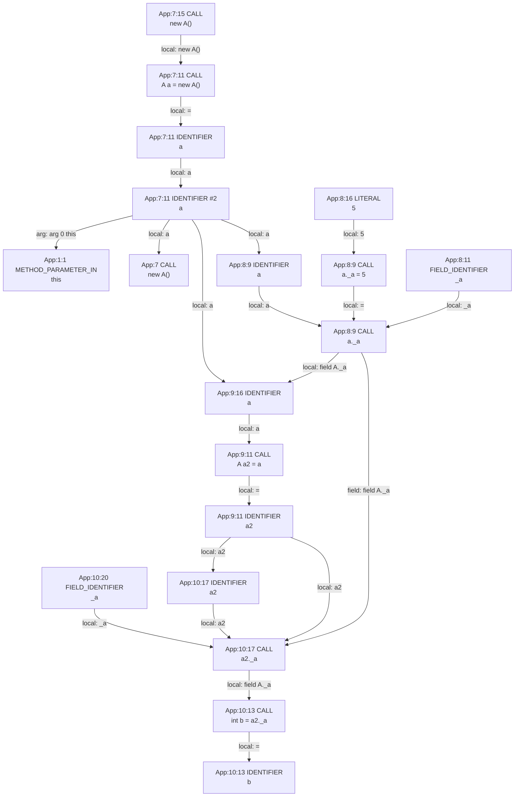

# ls: spike value graph

```mermaid
flowchart TD
  n0["App:10:13 CALL<br/>int b = a2._a"]
  n1["App:10:13 IDENTIFIER<br/>b"]
  n2["App:10:17 CALL<br/>a2._a"]
  n3["App:10:17 IDENTIFIER<br/>a2"]
  n4["App:10:20 FIELD_IDENTIFIER<br/>_a"]
  n5["App:1:1 METHOD_PARAMETER_IN<br/>this"]
  n6["App:7 CALL<br/>new A()"]
  n7["App:7:11 CALL<br/>A a = new A()"]
  n8["App:7:11 IDENTIFIER #2<br/>a"]
  n9["App:7:11 IDENTIFIER<br/>a"]
  n10["App:7:15 CALL<br/>new A()"]
  n11["App:8:11 FIELD_IDENTIFIER<br/>_a"]
  n12["App:8:16 LITERAL<br/>5"]
  n13["App:8:9 CALL<br/>a._a"]
  n14["App:8:9 CALL<br/>a._a = 5"]
  n15["App:8:9 IDENTIFIER<br/>a"]
  n16["App:9:11 CALL<br/>A a2 = a"]
  n17["App:9:11 IDENTIFIER<br/>a2"]
  n18["App:9:16 IDENTIFIER<br/>a"]
  n0 -->|"local: ="| n1
  n10 -->|"local: new A()"| n7
  n11 -->|"local: _a"| n13
  n12 -->|"local: 5"| n14
  n13 -->|"field: field A._a"| n2
  n13 -->|"local: field A._a"| n18
  n14 -->|"local: ="| n13
  n15 -->|"local: a"| n13
  n16 -->|"local: ="| n17
  n17 -->|"local: a2"| n2
  n17 -->|"local: a2"| n3
  n18 -->|"local: a"| n16
  n2 -->|"local: field A._a"| n0
  n3 -->|"local: a2"| n2
  n4 -->|"local: _a"| n2
  n7 -->|"local: ="| n9
  n8 -->|"arg: arg 0 this"| n5
  n8 -->|"local: a"| n15
  n8 -->|"local: a"| n18
  n8 -->|"local: a"| n6
  n9 -->|"local: a"| n8
```
