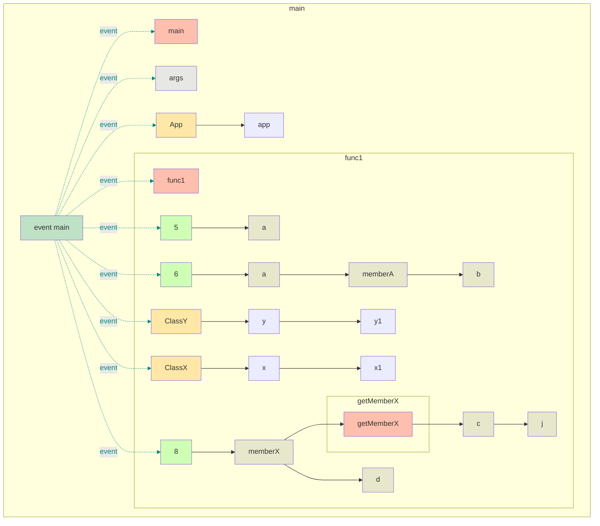

```mermaid
flowchart TD
  subgraph b0["main"]
    n1[event main]:::EVENT
    n2[main]:::RETURN
    n3[args]:::FUNC_PARAM
    n4[App]:::EXTERNAL
    n5[app]:::OBJ_VARIABLE
    n1[event main]:::EVENT -. event .-> n2[main]:::RETURN
    n1[event main]:::EVENT -. event .-> n3[args]:::FUNC_PARAM
    n1[event main]:::EVENT -. event .-> n4[App]:::EXTERNAL
    n1[event main]:::EVENT -. event .-> n7[func1]:::RETURN
    n1[event main]:::EVENT -. event .-> n8[5]:::LITERAL
    n1[event main]:::EVENT -. event .-> n10[6]:::LITERAL
    n1[event main]:::EVENT -. event .-> n14[ClassY]:::EXTERNAL
    n1[event main]:::EVENT -. event .-> n16[ClassX]:::EXTERNAL
    n1[event main]:::EVENT -. event .-> n18[8]:::LITERAL
    n4[App]:::EXTERNAL --> n5[app]:::OBJ_VARIABLE
    subgraph b6["func1"]
      n7[func1]:::RETURN
      n8[5]:::LITERAL
      n9[a]:::VARIABLE
      n10[6]:::LITERAL
      n11[a]:::VARIABLE
      n12[memberA]:::VARIABLE
      n13[b]:::VARIABLE
      n14[ClassY]:::EXTERNAL
      n15[y]:::OBJ_VARIABLE
      n16[ClassX]:::EXTERNAL
      n17[x]:::OBJ_VARIABLE
      n18[8]:::LITERAL
      n19[memberX]:::VARIABLE
      n20[y1]:::OBJ_VARIABLE
      n23[c]:::VARIABLE
      n24[x1]:::OBJ_VARIABLE
      n25[d]:::VARIABLE
      n26[j]:::VARIABLE
      n8[5]:::LITERAL --> n9[a]:::VARIABLE
      n10[6]:::LITERAL --> n11[a]:::VARIABLE
      n11[a]:::VARIABLE --> n12[memberA]:::VARIABLE
      n12[memberA]:::VARIABLE --> n13[b]:::VARIABLE
      n14[ClassY]:::EXTERNAL --> n15[y]:::OBJ_VARIABLE
      n15[y]:::OBJ_VARIABLE --> n20[y1]:::OBJ_VARIABLE
      n16[ClassX]:::EXTERNAL --> n17[x]:::OBJ_VARIABLE
      n17[x]:::OBJ_VARIABLE --> n24[x1]:::OBJ_VARIABLE
      n18[8]:::LITERAL --> n19[memberX]:::VARIABLE
      n19[memberX]:::VARIABLE --> n22[getMemberX]:::RETURN
      n19[memberX]:::VARIABLE --> n25[d]:::VARIABLE
      n23[c]:::VARIABLE --> n26[j]:::VARIABLE
      n22[getMemberX]:::RETURN --> n23[c]:::VARIABLE
      subgraph b21["getMemberX"]
        n22[getMemberX]:::RETURN
      end
    end
  end
  linkStyle 0 stroke:#00897b,color:#00897b
  linkStyle 1 stroke:#00897b,color:#00897b
  linkStyle 2 stroke:#00897b,color:#00897b
  linkStyle 3 stroke:#00897b,color:#00897b
  linkStyle 4 stroke:#00897b,color:#00897b
  linkStyle 5 stroke:#00897b,color:#00897b
  linkStyle 6 stroke:#00897b,color:#00897b
  linkStyle 7 stroke:#00897b,color:#00897b
  linkStyle 8 stroke:#00897b,color:#00897b
  classDef LITERAL fill:#00FF0030
  classDef VARIABLE fill:#80808030
  classDef BIN_OP fill:#80808080
  classDef FUNC_PARAM fill:#8080FF30
  classDef RETURN fill:#FF808080
  classDef EXTERNAL fill:#FFA50040
  classDef UNMODELLED fill:#FF000030,stroke-dasharray: 4 2
  classDef EVENT fill:#00897B40
```
