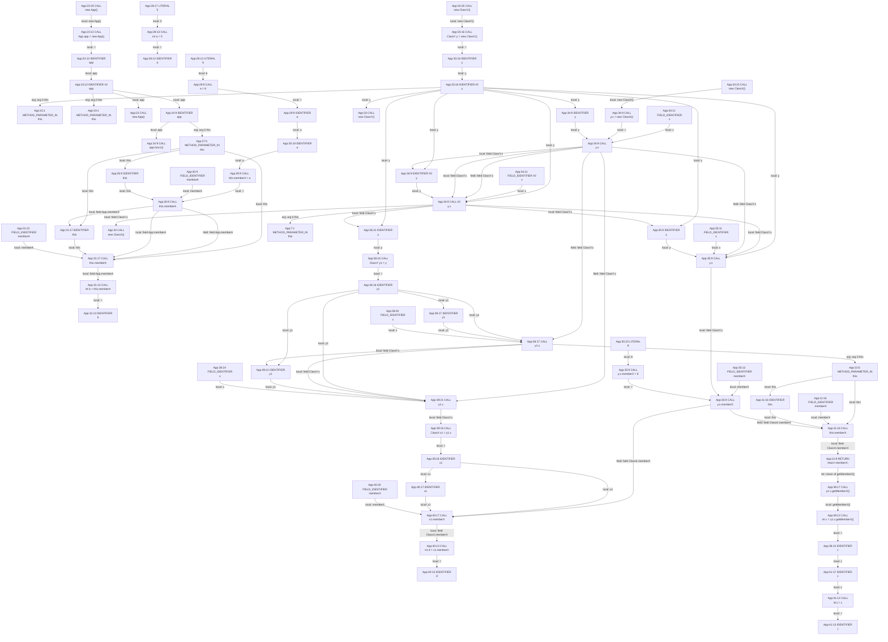

# member: spike value graph

```mermaid
flowchart TD
  n0["App:10:5 METHOD_PARAMETER_IN<br/>this"]
  n1["App:11:16 CALL<br/>this.memberX"]
  n2["App:11:16 FIELD_IDENTIFIER<br/>memberX"]
  n3["App:11:16 IDENTIFIER<br/>this"]
  n4["App:11:9 RETURN<br/>return memberX;"]
  n5["App:15:1 METHOD_PARAMETER_IN<br/>this"]
  n6["App:19:1 METHOD_PARAMETER_IN<br/>this"]
  n7["App:23 CALL<br/>new App()"]
  n8["App:23:13 CALL<br/>App app = new App()"]
  n9["App:23:13 IDENTIFIER #2<br/>app"]
  n10["App:23:13 IDENTIFIER<br/>app"]
  n11["App:23:19 CALL<br/>new App()"]
  n12["App:24:9 CALL<br/>app.func1()"]
  n13["App:24:9 IDENTIFIER<br/>app"]
  n14["App:27:5 METHOD_PARAMETER_IN<br/>this"]
  n15["App:28:13 CALL<br/>int a = 5"]
  n16["App:28:13 IDENTIFIER<br/>a"]
  n17["App:28:17 LITERAL<br/>5"]
  n18["App:29:13 LITERAL<br/>6"]
  n19["App:29:9 CALL<br/>a = 6"]
  n20["App:29:9 IDENTIFIER<br/>a"]
  n21["App:30:19 IDENTIFIER<br/>a"]
  n22["App:30:9 CALL<br/>this.memberA"]
  n23["App:30:9 CALL<br/>this.memberA = a"]
  n24["App:30:9 FIELD_IDENTIFIER<br/>memberA"]
  n25["App:30:9 IDENTIFIER<br/>this"]
  n26["App:31:13 CALL<br/>int b = this.memberA"]
  n27["App:31:13 IDENTIFIER<br/>b"]
  n28["App:31:17 CALL<br/>this.memberA"]
  n29["App:31:17 IDENTIFIER<br/>this"]
  n30["App:31:22 FIELD_IDENTIFIER<br/>memberA"]
  n31["App:33 CALL<br/>new ClassY()"]
  n32["App:33:16 CALL<br/>ClassY y = new ClassY()"]
  n33["App:33:16 IDENTIFIER #2<br/>y"]
  n34["App:33:16 IDENTIFIER<br/>y"]
  n35["App:33:20 CALL<br/>new ClassY()"]
  n36["App:34 CALL<br/>new ClassX()"]
  n37["App:34:11 FIELD_IDENTIFIER #2<br/>x"]
  n38["App:34:11 FIELD_IDENTIFIER<br/>x"]
  n39["App:34:15 CALL<br/>new ClassX()"]
  n40["App:34:9 CALL #2<br/>y.x"]
  n41["App:34:9 CALL<br/>y.x"]
  n42["App:34:9 CALL<br/>y.x = new ClassX()"]
  n43["App:34:9 IDENTIFIER #2<br/>y"]
  n44["App:34:9 IDENTIFIER<br/>y"]
  n45["App:35:11 FIELD_IDENTIFIER<br/>x"]
  n46["App:35:13 FIELD_IDENTIFIER<br/>memberX"]
  n47["App:35:23 LITERAL<br/>8"]
  n48["App:35:9 CALL<br/>y.x"]
  n49["App:35:9 CALL<br/>y.x.memberX"]
  n50["App:35:9 CALL<br/>y.x.memberX = 8"]
  n51["App:35:9 IDENTIFIER<br/>y"]
  n52["App:36:16 CALL<br/>ClassY y1 = y"]
  n53["App:36:16 IDENTIFIER<br/>y1"]
  n54["App:36:21 IDENTIFIER<br/>y"]
  n55["App:38:13 CALL<br/>int c = y1.x.getMemberX()"]
  n56["App:38:13 IDENTIFIER<br/>c"]
  n57["App:38:17 CALL<br/>y1.x"]
  n58["App:38:17 CALL<br/>y1.x.getMemberX()"]
  n59["App:38:17 IDENTIFIER<br/>y1"]
  n60["App:38:20 FIELD_IDENTIFIER<br/>x"]
  n61["App:39:16 CALL<br/>ClassX x1 = y1.x"]
  n62["App:39:16 IDENTIFIER<br/>x1"]
  n63["App:39:21 CALL<br/>y1.x"]
  n64["App:39:21 IDENTIFIER<br/>y1"]
  n65["App:39:24 FIELD_IDENTIFIER<br/>x"]
  n66["App:40:13 CALL<br/>int d = x1.memberX"]
  n67["App:40:13 IDENTIFIER<br/>d"]
  n68["App:40:17 CALL<br/>x1.memberX"]
  n69["App:40:17 IDENTIFIER<br/>x1"]
  n70["App:40:20 FIELD_IDENTIFIER<br/>memberX"]
  n71["App:41:13 CALL<br/>int j = c"]
  n72["App:41:13 IDENTIFIER<br/>j"]
  n73["App:41:17 IDENTIFIER<br/>c"]
  n74["App:7:1 METHOD_PARAMETER_IN<br/>this"]
  n0 -->|"local: this"| n1
  n0 -->|"local: this"| n3
  n1 -->|"local: field ClassX.memberX"| n4
  n10 -->|"local: app"| n9
  n11 -->|"local: new App()"| n8
  n13 -->|"arg: arg 0 this"| n14
  n13 -->|"local: app"| n12
  n14 -->|"local: this"| n25
  n14 -->|"local: this"| n28
  n14 -->|"local: this"| n29
  n15 -->|"local: ="| n16
  n17 -->|"local: 5"| n15
  n18 -->|"local: 6"| n19
  n19 -->|"local: ="| n20
  n2 -->|"local: memberX"| n1
  n20 -->|"local: a"| n21
  n21 -->|"local: a"| n23
  n22 -->|"field: field App.memberA"| n28
  n22 -->|"local: field App.memberA"| n28
  n22 -->|"local: field App.memberA"| n29
  n23 -->|"local: ="| n22
  n24 -->|"local: memberA"| n22
  n25 -->|"local: this"| n22
  n26 -->|"local: ="| n27
  n28 -->|"local: field App.memberA"| n26
  n29 -->|"local: this"| n28
  n3 -->|"local: this"| n1
  n30 -->|"local: memberA"| n28
  n32 -->|"local: ="| n34
  n33 -->|"arg: arg 0 this"| n5
  n33 -->|"local: y"| n31
  n33 -->|"local: y"| n40
  n33 -->|"local: y"| n43
  n33 -->|"local: y"| n44
  n33 -->|"local: y"| n48
  n33 -->|"local: y"| n51
  n33 -->|"local: y"| n54
  n34 -->|"local: y"| n33
  n35 -->|"local: new ClassY()"| n32
  n37 -->|"local: x"| n40
  n38 -->|"local: x"| n41
  n39 -->|"local: new ClassX()"| n42
  n4 -->|"ret: return of getMemberX()"| n58
  n40 -->|"arg: arg 0 this"| n74
  n40 -->|"local: field ClassY.x"| n36
  n40 -->|"local: field ClassY.x"| n48
  n40 -->|"local: field ClassY.x"| n51
  n40 -->|"local: field ClassY.x"| n54
  n41 -->|"field: field ClassY.x"| n40
  n41 -->|"field: field ClassY.x"| n48
  n41 -->|"field: field ClassY.x"| n57
  n41 -->|"field: field ClassY.x"| n63
  n41 -->|"local: field ClassY.x"| n40
  n41 -->|"local: field ClassY.x"| n43
  n42 -->|"local: ="| n41
  n43 -->|"local: y"| n40
  n44 -->|"local: y"| n41
  n45 -->|"local: x"| n48
  n46 -->|"local: memberX"| n49
  n47 -->|"local: 8"| n50
  n48 -->|"local: field ClassY.x"| n49
  n49 -->|"field: field ClassX.memberX"| n1
  n49 -->|"field: field ClassX.memberX"| n68
  n50 -->|"local: ="| n49
  n51 -->|"local: y"| n48
  n52 -->|"local: ="| n53
  n53 -->|"local: y1"| n57
  n53 -->|"local: y1"| n59
  n53 -->|"local: y1"| n63
  n53 -->|"local: y1"| n64
  n54 -->|"local: y"| n52
  n55 -->|"local: ="| n56
  n56 -->|"local: c"| n73
  n57 -->|"arg: arg 0 this"| n0
  n57 -->|"local: field ClassY.x"| n63
  n57 -->|"local: field ClassY.x"| n64
  n58 -->|"local: getMemberX()"| n55
  n59 -->|"local: y1"| n57
  n60 -->|"local: x"| n57
  n61 -->|"local: ="| n62
  n62 -->|"local: x1"| n68
  n62 -->|"local: x1"| n69
  n63 -->|"local: field ClassY.x"| n61
  n64 -->|"local: y1"| n63
  n65 -->|"local: x"| n63
  n66 -->|"local: ="| n67
  n68 -->|"local: field ClassX.memberX"| n66
  n69 -->|"local: x1"| n68
  n70 -->|"local: memberX"| n68
  n71 -->|"local: ="| n72
  n73 -->|"local: c"| n71
  n8 -->|"local: ="| n10
  n9 -->|"arg: arg 0 this"| n6
  n9 -->|"local: app"| n13
  n9 -->|"local: app"| n7
```
