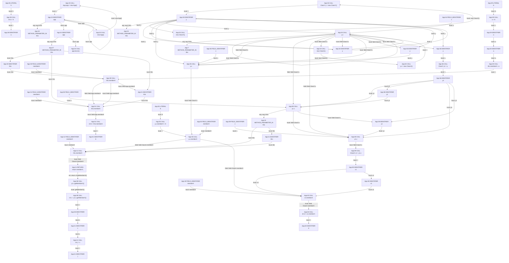

# member: spike value graph

```mermaid
flowchart TD
  n0["App:10 METHOD_PARAMETER_IN<br/>this"]
  n1["App:11 CALL<br/>this.memberX"]
  n2["App:11 FIELD_IDENTIFIER<br/>memberX"]
  n3["App:11 IDENTIFIER<br/>this"]
  n4["App:11 RETURN<br/>return memberX;"]
  n5["App:15 METHOD_PARAMETER_IN<br/>this"]
  n6["App:19 METHOD_PARAMETER_IN<br/>this"]
  n7["App:23 CALL<br/>App app = new App()"]
  n8["App:23 CALL<br/>new App()"]
  n9["App:23 IDENTIFIER<br/>app"]
  n10["App:24 CALL<br/>app.func1()"]
  n11["App:24 IDENTIFIER<br/>app"]
  n12["App:27 METHOD_PARAMETER_IN<br/>this"]
  n13["App:28 CALL<br/>int a = 5"]
  n14["App:28 IDENTIFIER<br/>a"]
  n15["App:28 LITERAL<br/>5"]
  n16["App:29 CALL<br/>a = 6"]
  n17["App:29 IDENTIFIER<br/>a"]
  n18["App:29 LITERAL<br/>6"]
  n19["App:30 CALL<br/>this.memberA"]
  n20["App:30 CALL<br/>this.memberA = a"]
  n21["App:30 FIELD_IDENTIFIER<br/>memberA"]
  n22["App:30 IDENTIFIER<br/>a"]
  n23["App:30 IDENTIFIER<br/>this"]
  n24["App:31 CALL<br/>int b = this.memberA"]
  n25["App:31 CALL<br/>this.memberA"]
  n26["App:31 FIELD_IDENTIFIER<br/>memberA"]
  n27["App:31 IDENTIFIER<br/>b"]
  n28["App:31 IDENTIFIER<br/>this"]
  n29["App:33 CALL<br/>ClassY y = new ClassY()"]
  n30["App:33 CALL<br/>new ClassY()"]
  n31["App:33 IDENTIFIER<br/>y"]
  n32["App:34 CALL<br/>new ClassX()"]
  n33["App:34 CALL<br/>y.x"]
  n34["App:34 CALL<br/>y.x = new ClassX()"]
  n35["App:34 FIELD_IDENTIFIER<br/>x"]
  n36["App:34 IDENTIFIER<br/>y"]
  n37["App:35 CALL<br/>y.x"]
  n38["App:35 CALL<br/>y.x.memberX"]
  n39["App:35 CALL<br/>y.x.memberX = 8"]
  n40["App:35 FIELD_IDENTIFIER<br/>memberX"]
  n41["App:35 FIELD_IDENTIFIER<br/>x"]
  n42["App:35 IDENTIFIER<br/>y"]
  n43["App:35 LITERAL<br/>8"]
  n44["App:36 CALL<br/>ClassY y1 = y"]
  n45["App:36 IDENTIFIER<br/>y"]
  n46["App:36 IDENTIFIER<br/>y1"]
  n47["App:38 CALL<br/>int c = y1.x.getMemberX()"]
  n48["App:38 CALL<br/>y1.x"]
  n49["App:38 CALL<br/>y1.x.getMemberX()"]
  n50["App:38 FIELD_IDENTIFIER<br/>x"]
  n51["App:38 IDENTIFIER<br/>c"]
  n52["App:38 IDENTIFIER<br/>y1"]
  n53["App:39 CALL<br/>ClassX x1 = y1.x"]
  n54["App:39 CALL<br/>y1.x"]
  n55["App:39 FIELD_IDENTIFIER<br/>x"]
  n56["App:39 IDENTIFIER<br/>x1"]
  n57["App:39 IDENTIFIER<br/>y1"]
  n58["App:40 CALL<br/>int d = x1.memberX"]
  n59["App:40 CALL<br/>x1.memberX"]
  n60["App:40 FIELD_IDENTIFIER<br/>memberX"]
  n61["App:40 IDENTIFIER<br/>d"]
  n62["App:40 IDENTIFIER<br/>x1"]
  n63["App:41 CALL<br/>int j = c"]
  n64["App:41 IDENTIFIER<br/>c"]
  n65["App:41 IDENTIFIER<br/>j"]
  n66["App:7 METHOD_PARAMETER_IN<br/>this"]
  n0 -->|"local: this"| n1
  n0 -->|"local: this"| n3
  n1 -->|"local: field ClassX.memberX"| n4
  n11 -->|"arg: arg 0 this"| n12
  n11 -->|"local: app"| n10
  n12 -->|"local: this"| n23
  n12 -->|"local: this"| n25
  n12 -->|"local: this"| n28
  n13 -->|"local: ="| n14
  n15 -->|"local: 5"| n13
  n16 -->|"local: ="| n17
  n17 -->|"local: a"| n22
  n18 -->|"local: 6"| n16
  n19 -->|"field: field App.memberA"| n25
  n19 -->|"local: field App.memberA"| n25
  n19 -->|"local: field App.memberA"| n28
  n2 -->|"local: memberX"| n1
  n20 -->|"local: ="| n19
  n21 -->|"local: memberA"| n19
  n22 -->|"local: a"| n20
  n23 -->|"local: this"| n19
  n24 -->|"local: ="| n27
  n25 -->|"local: field App.memberA"| n24
  n26 -->|"local: memberA"| n25
  n28 -->|"local: this"| n25
  n29 -->|"local: ="| n31
  n3 -->|"local: this"| n1
  n30 -->|"local: new ClassY()"| n29
  n31 -->|"arg: arg 0 this"| n5
  n31 -->|"local: y"| n30
  n31 -->|"local: y"| n31
  n31 -->|"local: y"| n33
  n31 -->|"local: y"| n36
  n31 -->|"local: y"| n37
  n31 -->|"local: y"| n42
  n31 -->|"local: y"| n45
  n32 -->|"local: new ClassX()"| n34
  n33 -->|"arg: arg 0 this"| n66
  n33 -->|"field: field ClassY.x"| n33
  n33 -->|"field: field ClassY.x"| n37
  n33 -->|"field: field ClassY.x"| n48
  n33 -->|"field: field ClassY.x"| n54
  n33 -->|"local: field ClassY.x"| n32
  n33 -->|"local: field ClassY.x"| n33
  n33 -->|"local: field ClassY.x"| n36
  n33 -->|"local: field ClassY.x"| n37
  n33 -->|"local: field ClassY.x"| n42
  n33 -->|"local: field ClassY.x"| n45
  n34 -->|"local: ="| n33
  n35 -->|"local: x"| n33
  n36 -->|"local: y"| n33
  n37 -->|"local: field ClassY.x"| n38
  n38 -->|"field: field ClassX.memberX"| n1
  n38 -->|"field: field ClassX.memberX"| n59
  n39 -->|"local: ="| n38
  n4 -->|"ret: return of getMemberX()"| n49
  n40 -->|"local: memberX"| n38
  n41 -->|"local: x"| n37
  n42 -->|"local: y"| n37
  n43 -->|"local: 8"| n39
  n44 -->|"local: ="| n46
  n45 -->|"local: y"| n44
  n46 -->|"local: y1"| n48
  n46 -->|"local: y1"| n52
  n46 -->|"local: y1"| n54
  n46 -->|"local: y1"| n57
  n47 -->|"local: ="| n51
  n48 -->|"arg: arg 0 this"| n0
  n48 -->|"local: field ClassY.x"| n54
  n48 -->|"local: field ClassY.x"| n57
  n49 -->|"local: getMemberX()"| n47
  n50 -->|"local: x"| n48
  n51 -->|"local: c"| n64
  n52 -->|"local: y1"| n48
  n53 -->|"local: ="| n56
  n54 -->|"local: field ClassY.x"| n53
  n55 -->|"local: x"| n54
  n56 -->|"local: x1"| n59
  n56 -->|"local: x1"| n62
  n57 -->|"local: y1"| n54
  n58 -->|"local: ="| n61
  n59 -->|"local: field ClassX.memberX"| n58
  n60 -->|"local: memberX"| n59
  n62 -->|"local: x1"| n59
  n63 -->|"local: ="| n65
  n64 -->|"local: c"| n63
  n7 -->|"local: ="| n9
  n8 -->|"local: new App()"| n7
  n9 -->|"arg: arg 0 this"| n6
  n9 -->|"local: app"| n11
  n9 -->|"local: app"| n8
  n9 -->|"local: app"| n9
```
