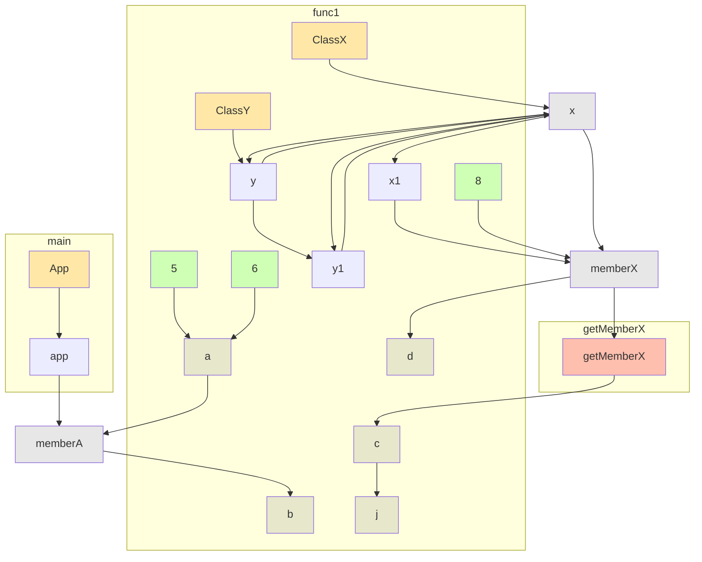

# member: spike value graph (condensed)

```mermaid
flowchart TD
  subgraph m0["func1"]
    n0["ClassX"]:::EXTERNAL
    n1["ClassY"]:::EXTERNAL
    n2["5"]:::LITERAL
    n3["6"]:::LITERAL
    n4["8"]:::LITERAL
    n5["a"]:::VARIABLE
    n6["b"]:::VARIABLE
    n7["c"]:::VARIABLE
    n8["d"]:::VARIABLE
    n9["j"]:::VARIABLE
    n10["x1"]:::OBJ_VARIABLE
    n11["y"]:::OBJ_VARIABLE
    n12["y1"]:::OBJ_VARIABLE
  end
  subgraph m1["main"]
    n13["App"]:::EXTERNAL
    n14["app"]:::OBJ_VARIABLE
  end
  subgraph m2["getMemberX"]
    n15["getMemberX"]:::RETURN
  end
  n16["memberA"]:::VARIABLE
  n17["memberX"]:::VARIABLE
  n18["x"]:::VARIABLE
  n0 --> n18
  n1 --> n11
  n10 --> n17
  n11 --> n12
  n11 --> n18
  n12 --> n18
  n13 --> n14
  n14 --> n16
  n15 --> n7
  n16 --> n6
  n17 --> n15
  n17 --> n8
  n18 --> n10
  n18 --> n11
  n18 --> n12
  n18 --> n17
  n2 --> n5
  n3 --> n5
  n4 --> n17
  n5 --> n16
  n7 --> n9
  classDef LITERAL fill:#00FF0030
  classDef VARIABLE fill:#80808030
  classDef BIN_OP fill:#80808080
  classDef FUNC_PARAM fill:#8080FF30
  classDef RETURN fill:#FF808080
  classDef EXTERNAL fill:#FFA50040
  classDef UNMODELLED fill:#FF000030,stroke-dasharray: 4 2
```
