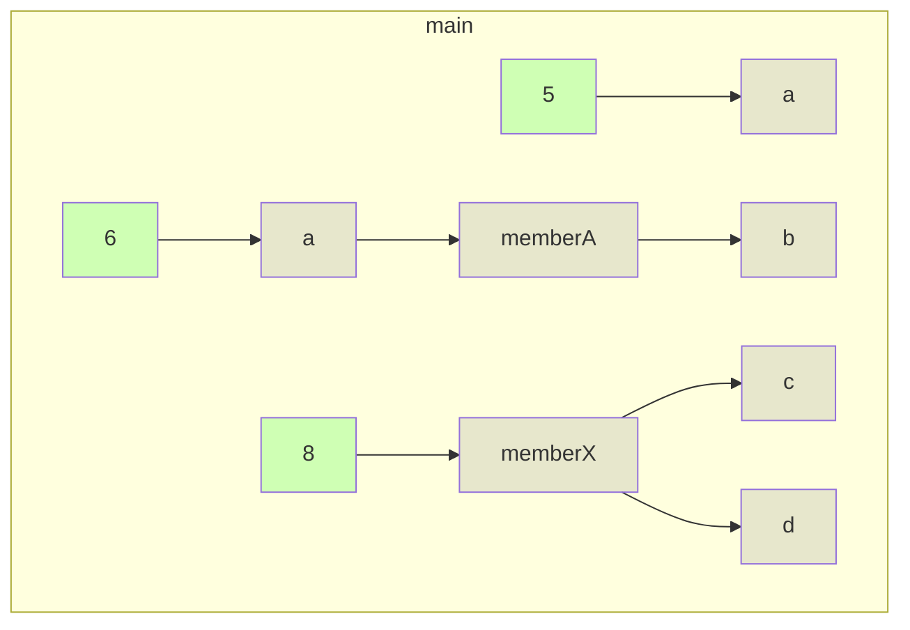

```mermaid
flowchart TD
  subgraph main
    453632840[5]:::LITERAL --> 453632832[a]:::VARIABLE
    453632851[a]:::VARIABLE --> 453632866[memberA]:::VARIABLE
    453632855[6]:::LITERAL --> 453632851[a]:::VARIABLE
    453632866[memberA]:::VARIABLE --> 453632887[b]:::VARIABLE
    453632974[memberX]:::VARIABLE --> 453633022[c]:::VARIABLE
    453632974[memberX]:::VARIABLE --> 453633078[d]:::VARIABLE
    453632988[8]:::LITERAL --> 453632974[memberX]:::VARIABLE
  end
  classDef LITERAL fill:#00FF0030
  classDef VARIABLE fill:#80808030
  classDef BIN_OP fill:#80808080
  classDef FUNC_PARAM fill:#8080FF30
  classDef RETURN fill:#FF808080
```
