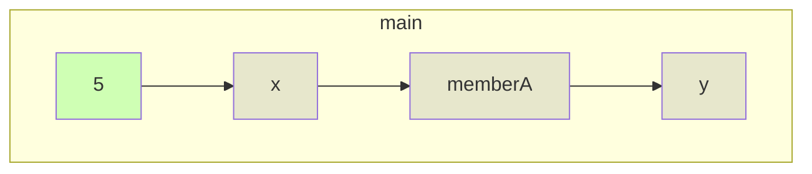

```mermaid
flowchart TD
  subgraph main
    2[5]:::LITERAL --> 3[x]:::VARIABLE
    3[x]:::VARIABLE --> 4[memberA]:::VARIABLE
    4[memberA]:::VARIABLE --> 5[y]:::VARIABLE
  end
  classDef LITERAL fill:#00FF0030
  classDef VARIABLE fill:#80808030
  classDef BIN_OP fill:#80808080
  classDef FUNC_PARAM fill:#8080FF30
  classDef RETURN fill:#FF808080
```
