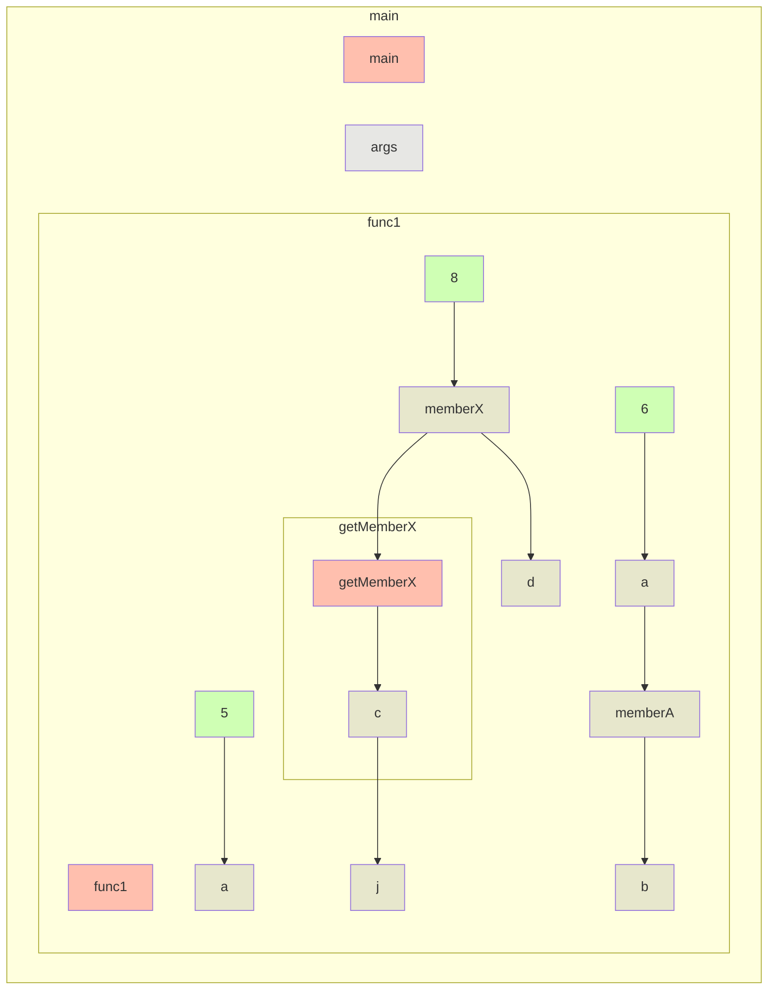

```mermaid
flowchart TD
  subgraph 4309014["main"]
    56853577[main]:::RETURN
    546291172[args]:::FUNC_PARAM
    subgraph 1150435712["func1"]
      -1330406687[5]:::LITERAL
      -1330406634[6]:::LITERAL
      -1330405968[a]:::VARIABLE
      -1330405770[b]:::VARIABLE
      -1330405517[8]:::LITERAL
      -1330403921[c]:::VARIABLE
      -1330403717[d]:::VARIABLE
      -1330402873[j]:::VARIABLE
      495307795[a]:::VARIABLE
      2157795935[func1]:::RETURN
      16626294009[memberA]:::VARIABLE
      16626294400[memberX]:::VARIABLE
      -1330406687[5]:::LITERAL --> -1330405968[a]:::VARIABLE
      -1330406634[6]:::LITERAL --> 495307795[a]:::VARIABLE
      -1330405517[8]:::LITERAL --> 16626294400[memberX]:::VARIABLE
      -1330403921[c]:::VARIABLE --> -1330402873[j]:::VARIABLE
      495307795[a]:::VARIABLE --> 16626294009[memberA]:::VARIABLE
      16626294009[memberA]:::VARIABLE --> -1330405770[b]:::VARIABLE
      16626294400[memberX]:::VARIABLE --> 32427208833[getMemberX]:::RETURN
      16626294400[memberX]:::VARIABLE --> -1330403717[d]:::VARIABLE
      subgraph -1976388525["getMemberX"]
        32427208833[getMemberX]:::RETURN
        32427208833[getMemberX]:::RETURN --> -1330403921[c]:::VARIABLE
      end
    end
  end
  classDef LITERAL fill:#00FF0030
  classDef VARIABLE fill:#80808030
  classDef BIN_OP fill:#80808080
  classDef FUNC_PARAM fill:#8080FF30
  classDef RETURN fill:#FF808080
```
