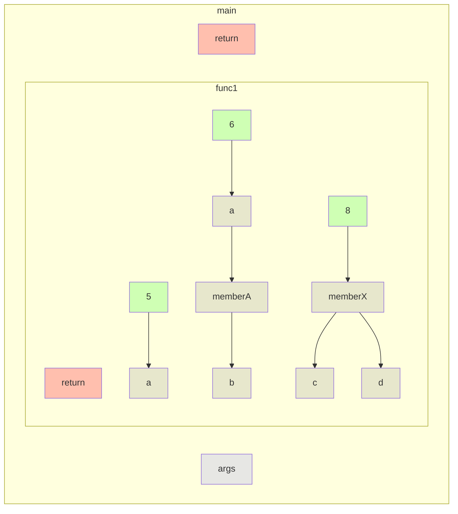

```mermaid
flowchart TD
  subgraph main
    7711766679[args]:::FUNC_PARAM
    575370[return]:::RETURN
    subgraph func1
      232679[return]:::RETURN
      509392[8]:::LITERAL
      642294[5]:::LITERAL
      947327[6]:::LITERAL
      8207065437[memberA]:::VARIABLE
      8207065182[a]:::VARIABLE
      8207065794[b]:::VARIABLE
      8207068174[c]:::VARIABLE
      8207069126[d]:::VARIABLE
      8207067358[memberX]:::VARIABLE
      509392[8]:::LITERAL --> 8207067358[memberX]:::VARIABLE
      642294[5]:::LITERAL --> 8207064859[a]:::VARIABLE
      947327[6]:::LITERAL --> 8207065182[a]:::VARIABLE
      8207065437[memberA]:::VARIABLE --> 8207065794[b]:::VARIABLE
      8207065182[a]:::VARIABLE --> 8207065437[memberA]:::VARIABLE
      8207067358[memberX]:::VARIABLE --> 8207068174[c]:::VARIABLE
      8207067358[memberX]:::VARIABLE --> 8207069126[d]:::VARIABLE
    end
  end
  classDef LITERAL fill:#00FF0030
  classDef VARIABLE fill:#80808030
  classDef BIN_OP fill:#80808080
  classDef FUNC_PARAM fill:#8080FF30
  classDef RETURN fill:#FF808080
```
