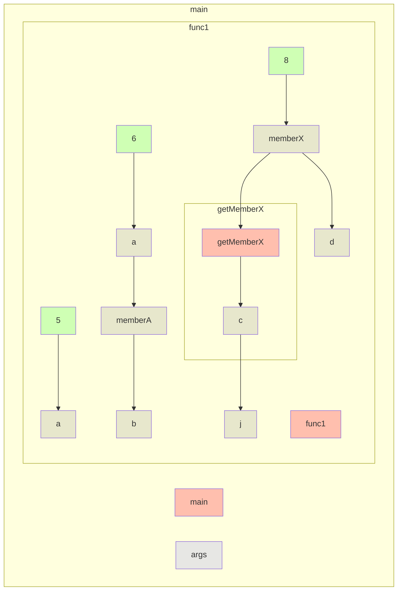

```mermaid
flowchart TD
  subgraph 4308940["main"]
    56996632[main]:::RETURN
    1296565521[args]:::FUNC_PARAM
    subgraph 4321927["func1"]
      495569748[5]:::LITERAL
      495573675[a]:::VARIABLE
      495574100[6]:::LITERAL
      495584096[b]:::VARIABLE
      495614016[8]:::LITERAL
      495634110[c]:::VARIABLE
      495651756[d]:::VARIABLE
      495659950[j]:::VARIABLE
      1662745119[func1]:::RETURN
      16626564224[memberA]:::VARIABLE
      16626597272[memberX]:::VARIABLE
      495569748[5]:::LITERAL --> 495568184[a]:::VARIABLE
      495573675[a]:::VARIABLE --> 16626564224[memberA]:::VARIABLE
      495574100[6]:::LITERAL --> 495573675[a]:::VARIABLE
      495614016[8]:::LITERAL --> 16626597272[memberX]:::VARIABLE
      495634110[c]:::VARIABLE --> 495659950[j]:::VARIABLE
      16626564224[memberA]:::VARIABLE --> 495584096[b]:::VARIABLE
      16626597272[memberX]:::VARIABLE --> 34253249147[getMemberX]:::RETURN
      16626597272[memberX]:::VARIABLE --> 495651756[d]:::VARIABLE
      subgraph 4332694["getMemberX"]
        34253249147[getMemberX]:::RETURN
        34253249147[getMemberX]:::RETURN --> 495634110[c]:::VARIABLE
      end
    end
  end
  classDef LITERAL fill:#00FF0030
  classDef VARIABLE fill:#80808030
  classDef BIN_OP fill:#80808080
  classDef FUNC_PARAM fill:#8080FF30
  classDef RETURN fill:#FF808080
```
