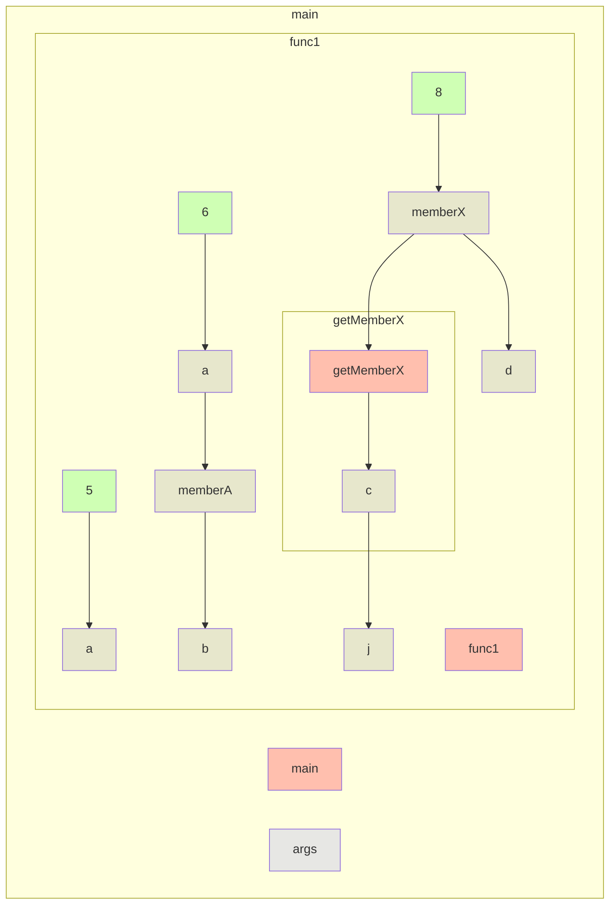

```mermaid
flowchart TD
  subgraph 4308940["main"]
    56996632[main]:::RETURN
    1296565521[args]:::FUNC_PARAM
    subgraph 4321927["func1"]
      495511592[5]:::LITERAL
      495515519[a]:::VARIABLE
      495515944[6]:::LITERAL
      495525940[b]:::VARIABLE
      495555860[8]:::LITERAL
      495575954[c]:::VARIABLE
      495593600[d]:::VARIABLE
      495601794[j]:::VARIABLE
      1662745119[func1]:::RETURN
      16626506068[memberA]:::VARIABLE
      16626539116[memberX]:::VARIABLE
      495511592[5]:::LITERAL --> 495510028[a]:::VARIABLE
      495515519[a]:::VARIABLE --> 16626506068[memberA]:::VARIABLE
      495515944[6]:::LITERAL --> 495515519[a]:::VARIABLE
      495555860[8]:::LITERAL --> 16626539116[memberX]:::VARIABLE
      495575954[c]:::VARIABLE --> 495601794[j]:::VARIABLE
      16626506068[memberA]:::VARIABLE --> 495525940[b]:::VARIABLE
      16626539116[memberX]:::VARIABLE --> 34253190991[getMemberX]:::RETURN
      16626539116[memberX]:::VARIABLE --> 495593600[d]:::VARIABLE
      subgraph 4332694["getMemberX"]
        34253190991[getMemberX]:::RETURN
        34253190991[getMemberX]:::RETURN --> 495575954[c]:::VARIABLE
      end
    end
  end
  classDef LITERAL fill:#00FF0030
  classDef VARIABLE fill:#80808030
  classDef BIN_OP fill:#80808080
  classDef FUNC_PARAM fill:#8080FF30
  classDef RETURN fill:#FF808080
```
