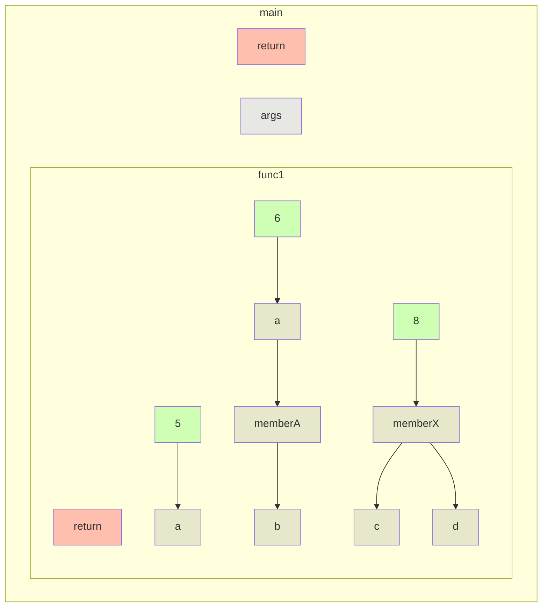

```mermaid
flowchart TD
  subgraph main
    453632783[return]:::RETURN
    453632807[args]:::FUNC_PARAM
    subgraph func1
      453632885[return]:::RETURN
      453632924[5]:::LITERAL
      453632935[a]:::VARIABLE
      453632939[6]:::LITERAL
      453632950[memberA]:::VARIABLE
      453632971[b]:::VARIABLE
      453633063[memberX]:::VARIABLE
      453633077[8]:::LITERAL
      453633111[c]:::VARIABLE
      453633167[d]:::VARIABLE
      453632924[5]:::LITERAL --> 453632916[a]:::VARIABLE
      453632935[a]:::VARIABLE --> 453632950[memberA]:::VARIABLE
      453632939[6]:::LITERAL --> 453632935[a]:::VARIABLE
      453632950[memberA]:::VARIABLE --> 453632971[b]:::VARIABLE
      453633063[memberX]:::VARIABLE --> 453633111[c]:::VARIABLE
      453633063[memberX]:::VARIABLE --> 453633167[d]:::VARIABLE
      453633077[8]:::LITERAL --> 453633063[memberX]:::VARIABLE
    end
  end
  classDef LITERAL fill:#00FF0030
  classDef VARIABLE fill:#80808030
  classDef BIN_OP fill:#80808080
  classDef FUNC_PARAM fill:#8080FF30
  classDef RETURN fill:#FF808080
```
