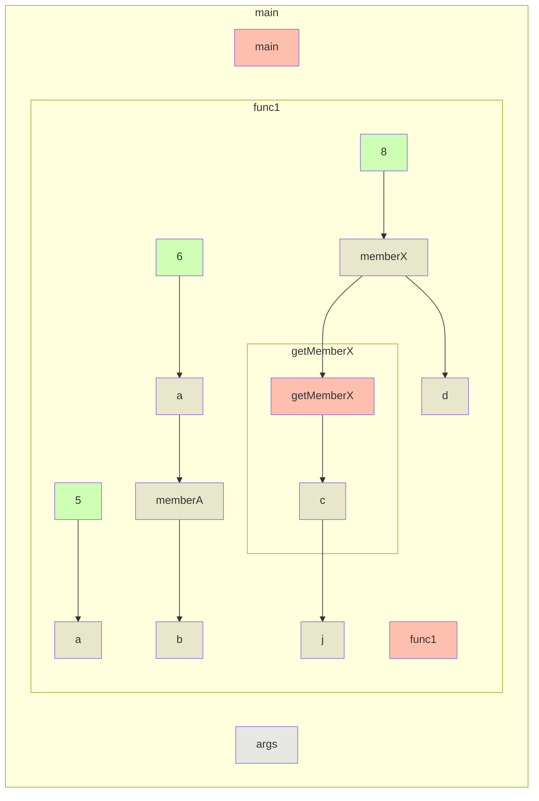

```mermaid
flowchart TD
  subgraph 4309014["main"]
    56853577[main]:::RETURN
    2153970218[args]:::FUNC_PARAM
    subgraph 1148283940["func1"]
      495249639[a]:::VARIABLE
      2102928777[5]:::LITERAL
      2102928830[6]:::LITERAL
      2102929694[b]:::VARIABLE
      2102929947[8]:::LITERAL
      2102931543[c]:::VARIABLE
      2102931747[d]:::VARIABLE
      2102932591[j]:::VARIABLE
      2157737779[func1]:::RETURN
      16626235853[memberA]:::VARIABLE
      16626236244[memberX]:::VARIABLE
      495249639[a]:::VARIABLE --> 16626235853[memberA]:::VARIABLE
      2102928777[5]:::LITERAL --> 2102929496[a]:::VARIABLE
      2102928830[6]:::LITERAL --> 495249639[a]:::VARIABLE
      2102929947[8]:::LITERAL --> 16626236244[memberX]:::VARIABLE
      2102931543[c]:::VARIABLE --> 2102932591[j]:::VARIABLE
      16626235853[memberA]:::VARIABLE --> 2102929694[b]:::VARIABLE
      16626236244[memberX]:::VARIABLE --> 34252865251[getMemberX]:::RETURN
      16626236244[memberX]:::VARIABLE --> 2102931747[d]:::VARIABLE
      subgraph 1148389501["getMemberX"]
        34252865251[getMemberX]:::RETURN
        34252865251[getMemberX]:::RETURN --> 2102931543[c]:::VARIABLE
      end
    end
  end
  classDef LITERAL fill:#00FF0030
  classDef VARIABLE fill:#80808030
  classDef BIN_OP fill:#80808080
  classDef FUNC_PARAM fill:#8080FF30
  classDef RETURN fill:#FF808080
```
