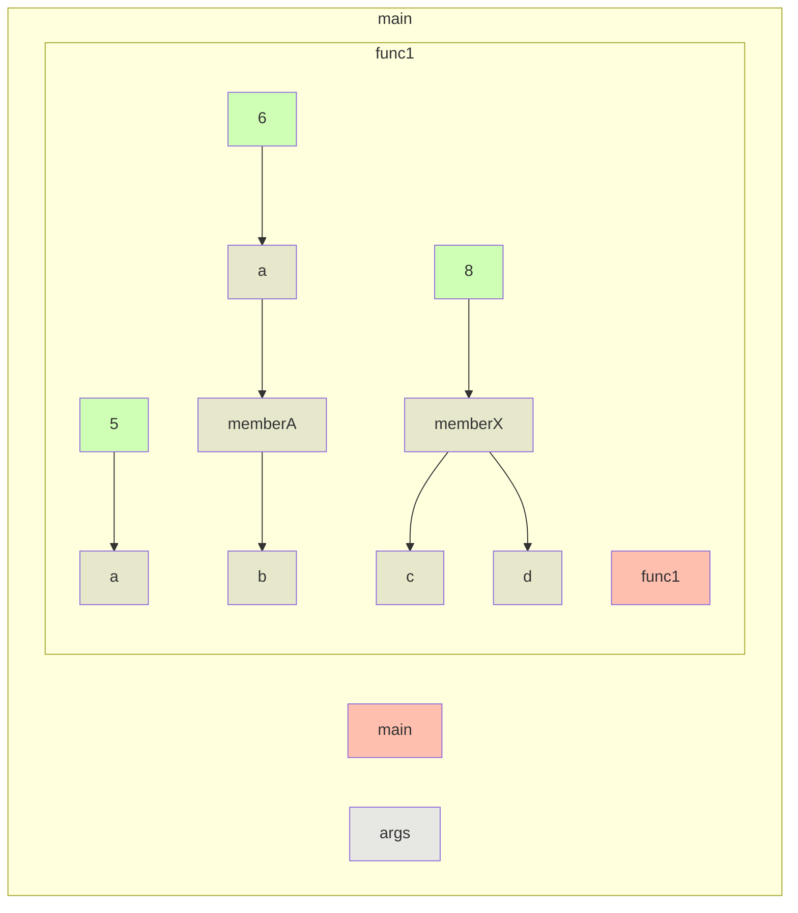

```mermaid
flowchart TD
  subgraph 4308940["main"]
    56996632[main]:::RETURN
    1296547892[args]:::FUNC_PARAM
    subgraph 4319670["func1"]
      495551260[5]:::LITERAL
      495555187[a]:::VARIABLE
      495555612[6]:::LITERAL
      495565608[b]:::VARIABLE
      495595528[8]:::LITERAL
      495606085[c]:::VARIABLE
      495622286[d]:::VARIABLE
      1662727490[func1]:::RETURN
      16626545736[memberA]:::VARIABLE
      16626578784[memberX]:::VARIABLE
      495551260[5]:::LITERAL --> 495549696[a]:::VARIABLE
      495555187[a]:::VARIABLE --> 16626545736[memberA]:::VARIABLE
      495555612[6]:::LITERAL --> 495555187[a]:::VARIABLE
      495595528[8]:::LITERAL --> 16626578784[memberX]:::VARIABLE
      16626545736[memberA]:::VARIABLE --> 495565608[b]:::VARIABLE
      16626578784[memberX]:::VARIABLE --> 495606085[c]:::VARIABLE
      16626578784[memberX]:::VARIABLE --> 495622286[d]:::VARIABLE
    end
  end
  classDef LITERAL fill:#00FF0030
  classDef VARIABLE fill:#80808030
  classDef BIN_OP fill:#80808080
  classDef FUNC_PARAM fill:#8080FF30
  classDef RETURN fill:#FF808080
```
