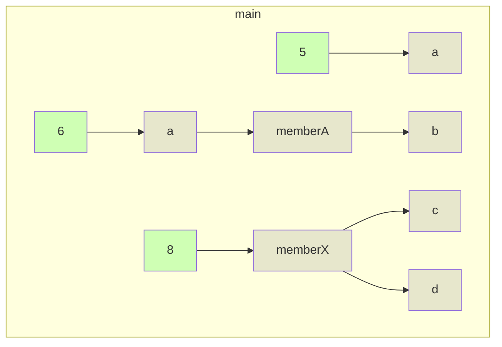

```mermaid
flowchart TD
  subgraph main
    3[5]:::LITERAL --> 2[a]:::VARIABLE
    4[a]:::VARIABLE --> 6[memberA]:::VARIABLE
    5[6]:::LITERAL --> 4[a]:::VARIABLE
    6[memberA]:::VARIABLE --> 7[b]:::VARIABLE
    8[memberX]:::VARIABLE --> 10[c]:::VARIABLE
    8[memberX]:::VARIABLE --> 11[d]:::VARIABLE
    9[8]:::LITERAL --> 8[memberX]:::VARIABLE
  end
  classDef LITERAL fill:#00FF0030
  classDef VARIABLE fill:#80808030
  classDef BIN_OP fill:#80808080
  classDef FUNC_PARAM fill:#8080FF30
  classDef RETURN fill:#FF808080
```
