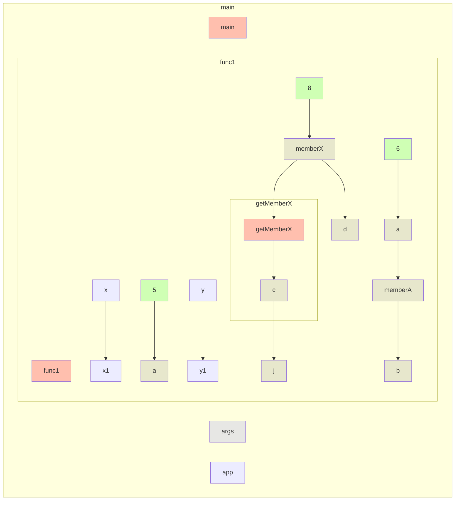

```mermaid
flowchart TD
  subgraph 4309014["main"]
    -1776229095[args]:::FUNC_PARAM
    -816970351[app]:::OBJ_VARIABLE
    56853577[main]:::RETURN
    subgraph -218949196["func1"]
      -818584777[a]:::VARIABLE
      -818584386[x]:::OBJ_VARIABLE
      -425259420[a]:::VARIABLE
      -425237283[5]:::LITERAL
      -425233174[6]:::LITERAL
      -425201835[b]:::VARIABLE
      -425171679[y]:::OBJ_VARIABLE
      -425089242[8]:::LITERAL
      -425022520[y1]:::OBJ_VARIABLE
      -424402141[c]:::VARIABLE
      -424342723[d]:::VARIABLE
      -424313825[j]:::VARIABLE
      -424308967[x1]:::OBJ_VARIABLE
      843903363[func1]:::RETURN
      15312401437[memberA]:::VARIABLE
      15312401828[memberX]:::VARIABLE
      -818584777[a]:::VARIABLE --> 15312401437[memberA]:::VARIABLE
      -818584386[x]:::OBJ_VARIABLE --> -424308967[x1]:::OBJ_VARIABLE
      -425237283[5]:::LITERAL --> -425259420[a]:::VARIABLE
      -425233174[6]:::LITERAL --> -818584777[a]:::VARIABLE
      -425171679[y]:::OBJ_VARIABLE --> -425022520[y1]:::OBJ_VARIABLE
      -425089242[8]:::LITERAL --> 15312401828[memberX]:::VARIABLE
      -424402141[c]:::VARIABLE --> -424313825[j]:::VARIABLE
      15312401437[memberA]:::VARIABLE --> -425201835[b]:::VARIABLE
      15312401828[memberX]:::VARIABLE --> 33333213288[getMemberX]:::RETURN
      15312401828[memberX]:::VARIABLE --> -424342723[d]:::VARIABLE
      subgraph 1481005238["getMemberX"]
        33333213288[getMemberX]:::RETURN
        33333213288[getMemberX]:::RETURN --> -424402141[c]:::VARIABLE
      end
    end
  end
  classDef LITERAL fill:#00FF0030
  classDef VARIABLE fill:#80808030
  classDef BIN_OP fill:#80808080
  classDef FUNC_PARAM fill:#8080FF30
  classDef RETURN fill:#FF808080
```
