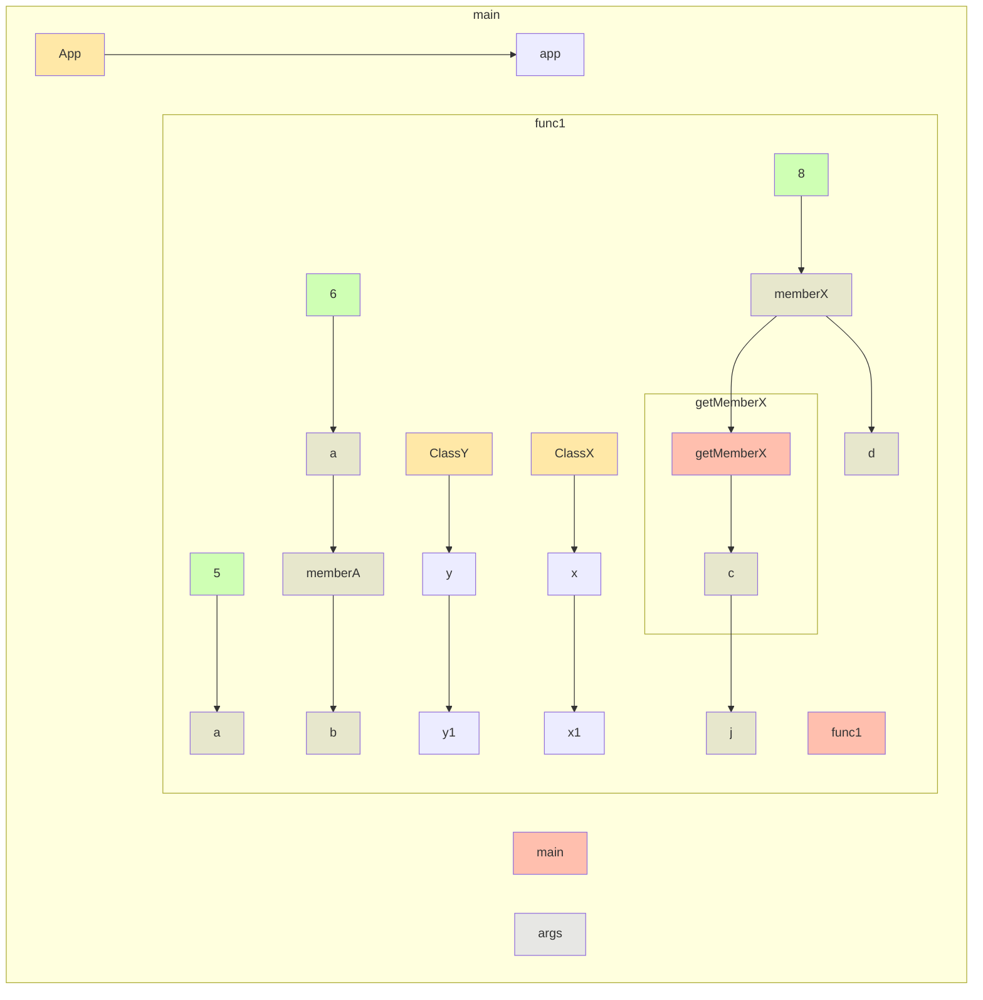

```mermaid
flowchart TD
  subgraph b0["main"]
    n1[main]:::RETURN
    n2[args]:::FUNC_PARAM
    n3[App]:::EXTERNAL
    n4[app]:::OBJ_VARIABLE
    n3[App]:::EXTERNAL --> n4[app]:::OBJ_VARIABLE
    subgraph b5["func1"]
      n6[func1]:::RETURN
      n7[5]:::LITERAL
      n8[a]:::VARIABLE
      n9[6]:::LITERAL
      n10[a]:::VARIABLE
      n11[memberA]:::VARIABLE
      n12[b]:::VARIABLE
      n13[ClassY]:::EXTERNAL
      n14[y]:::OBJ_VARIABLE
      n15[ClassX]:::EXTERNAL
      n16[x]:::OBJ_VARIABLE
      n17[8]:::LITERAL
      n18[memberX]:::VARIABLE
      n19[y1]:::OBJ_VARIABLE
      n22[c]:::VARIABLE
      n23[x1]:::OBJ_VARIABLE
      n24[d]:::VARIABLE
      n25[j]:::VARIABLE
      n7[5]:::LITERAL --> n8[a]:::VARIABLE
      n9[6]:::LITERAL --> n10[a]:::VARIABLE
      n10[a]:::VARIABLE --> n11[memberA]:::VARIABLE
      n11[memberA]:::VARIABLE --> n12[b]:::VARIABLE
      n13[ClassY]:::EXTERNAL --> n14[y]:::OBJ_VARIABLE
      n14[y]:::OBJ_VARIABLE --> n19[y1]:::OBJ_VARIABLE
      n15[ClassX]:::EXTERNAL --> n16[x]:::OBJ_VARIABLE
      n16[x]:::OBJ_VARIABLE --> n23[x1]:::OBJ_VARIABLE
      n17[8]:::LITERAL --> n18[memberX]:::VARIABLE
      n18[memberX]:::VARIABLE --> n21[getMemberX]:::RETURN
      n18[memberX]:::VARIABLE --> n24[d]:::VARIABLE
      n22[c]:::VARIABLE --> n25[j]:::VARIABLE
      subgraph b20["getMemberX"]
        n21[getMemberX]:::RETURN
        n21[getMemberX]:::RETURN --> n22[c]:::VARIABLE
      end
    end
  end
  classDef LITERAL fill:#00FF0030
  classDef VARIABLE fill:#80808030
  classDef BIN_OP fill:#80808080
  classDef FUNC_PARAM fill:#8080FF30
  classDef RETURN fill:#FF808080
  classDef EXTERNAL fill:#FFA50040
```
