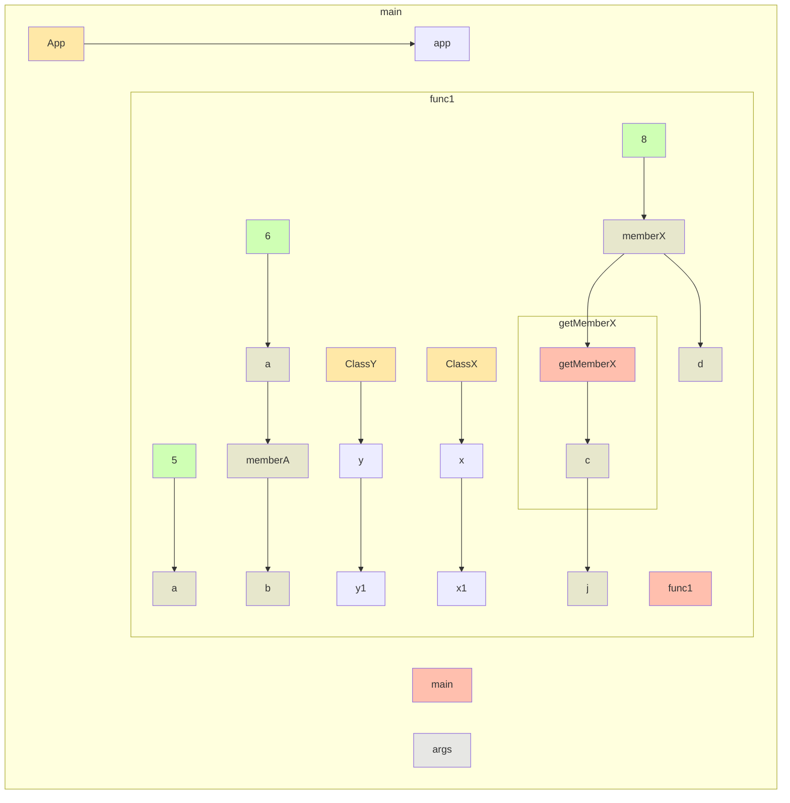

```mermaid
flowchart TD
  subgraph b0["main"]
    n1[main]:::RETURN
    n2[args]:::FUNC_PARAM
    n3[app]:::OBJ_VARIABLE
    n4[App]:::EXTERNAL
    n4[App]:::EXTERNAL --> n3[app]:::OBJ_VARIABLE
    subgraph b5["func1"]
      n6[func1]:::RETURN
      n7[a]:::VARIABLE
      n8[5]:::LITERAL
      n9[a]:::VARIABLE
      n10[6]:::LITERAL
      n11[memberA]:::VARIABLE
      n12[b]:::VARIABLE
      n13[y]:::OBJ_VARIABLE
      n14[ClassY]:::EXTERNAL
      n15[x]:::OBJ_VARIABLE
      n16[ClassX]:::EXTERNAL
      n17[memberX]:::VARIABLE
      n18[8]:::LITERAL
      n19[y1]:::OBJ_VARIABLE
      n20[c]:::VARIABLE
      n23[x1]:::OBJ_VARIABLE
      n24[d]:::VARIABLE
      n25[j]:::VARIABLE
      n8[5]:::LITERAL --> n7[a]:::VARIABLE
      n9[a]:::VARIABLE --> n11[memberA]:::VARIABLE
      n10[6]:::LITERAL --> n9[a]:::VARIABLE
      n11[memberA]:::VARIABLE --> n12[b]:::VARIABLE
      n13[y]:::OBJ_VARIABLE --> n19[y1]:::OBJ_VARIABLE
      n14[ClassY]:::EXTERNAL --> n13[y]:::OBJ_VARIABLE
      n15[x]:::OBJ_VARIABLE --> n23[x1]:::OBJ_VARIABLE
      n16[ClassX]:::EXTERNAL --> n15[x]:::OBJ_VARIABLE
      n17[memberX]:::VARIABLE --> n22[getMemberX]:::RETURN
      n17[memberX]:::VARIABLE --> n24[d]:::VARIABLE
      n18[8]:::LITERAL --> n17[memberX]:::VARIABLE
      n20[c]:::VARIABLE --> n25[j]:::VARIABLE
      subgraph b21["getMemberX"]
        n22[getMemberX]:::RETURN
        n22[getMemberX]:::RETURN --> n20[c]:::VARIABLE
      end
    end
  end
  classDef LITERAL fill:#00FF0030
  classDef VARIABLE fill:#80808030
  classDef BIN_OP fill:#80808080
  classDef FUNC_PARAM fill:#8080FF30
  classDef RETURN fill:#FF808080
  classDef EXTERNAL fill:#FFA50040
```
