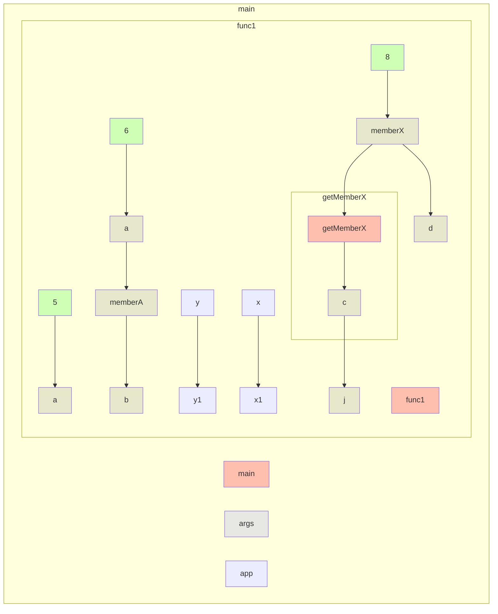

```mermaid
flowchart TD
  subgraph b0["main"]
    n1[main]:::RETURN
    n2[args]:::FUNC_PARAM
    n3[app]:::OBJ_VARIABLE
    subgraph b4["func1"]
      n5[func1]:::RETURN
      n6[a]:::VARIABLE
      n7[5]:::LITERAL
      n8[a]:::VARIABLE
      n9[6]:::LITERAL
      n10[memberA]:::VARIABLE
      n11[b]:::VARIABLE
      n12[y]:::OBJ_VARIABLE
      n13[x]:::OBJ_VARIABLE
      n14[memberX]:::VARIABLE
      n15[8]:::LITERAL
      n16[y1]:::OBJ_VARIABLE
      n17[c]:::VARIABLE
      n20[x1]:::OBJ_VARIABLE
      n21[d]:::VARIABLE
      n22[j]:::VARIABLE
      n7[5]:::LITERAL --> n6[a]:::VARIABLE
      n8[a]:::VARIABLE --> n10[memberA]:::VARIABLE
      n9[6]:::LITERAL --> n8[a]:::VARIABLE
      n10[memberA]:::VARIABLE --> n11[b]:::VARIABLE
      n12[y]:::OBJ_VARIABLE --> n16[y1]:::OBJ_VARIABLE
      n13[x]:::OBJ_VARIABLE --> n20[x1]:::OBJ_VARIABLE
      n14[memberX]:::VARIABLE --> n19[getMemberX]:::RETURN
      n14[memberX]:::VARIABLE --> n21[d]:::VARIABLE
      n15[8]:::LITERAL --> n14[memberX]:::VARIABLE
      n17[c]:::VARIABLE --> n22[j]:::VARIABLE
      subgraph b18["getMemberX"]
        n19[getMemberX]:::RETURN
        n19[getMemberX]:::RETURN --> n17[c]:::VARIABLE
      end
    end
  end
  classDef LITERAL fill:#00FF0030
  classDef VARIABLE fill:#80808030
  classDef BIN_OP fill:#80808080
  classDef FUNC_PARAM fill:#8080FF30
  classDef RETURN fill:#FF808080
  classDef EXTERNAL fill:#FFA50040
```
