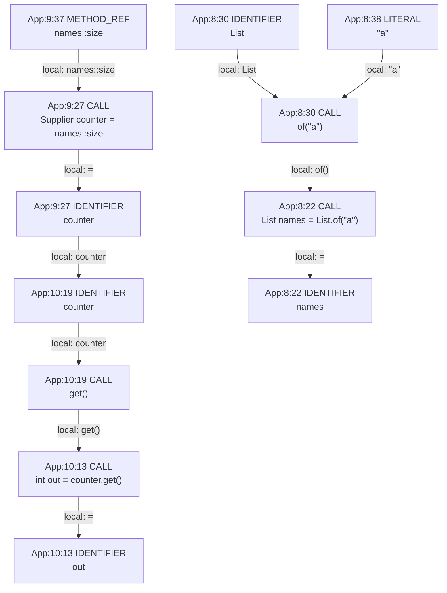

# memberReference: spike value graph

```mermaid
flowchart TD
  n0["App:10:13 CALL<br/>int out = counter.get()"]
  n1["App:10:13 IDENTIFIER<br/>out"]
  n2["App:10:19 CALL<br/>get()"]
  n3["App:10:19 IDENTIFIER<br/>counter"]
  n4["App:8:22 CALL<br/>List names = List.of(#quot;a#quot;)"]
  n5["App:8:22 IDENTIFIER<br/>names"]
  n6["App:8:30 CALL<br/>of(#quot;a#quot;)"]
  n7["App:8:30 IDENTIFIER<br/>List"]
  n8["App:8:38 LITERAL<br/>#quot;a#quot;"]
  n9["App:9:27 CALL<br/>Supplier counter = names::size"]
  n10["App:9:27 IDENTIFIER<br/>counter"]
  n11["App:9:37 METHOD_REF<br/>names::size"]
  n0 -->|"local: ="| n1
  n10 -->|"local: counter"| n3
  n11 -->|"local: names::size"| n9
  n2 -->|"local: get()"| n0
  n3 -->|"local: counter"| n2
  n4 -->|"local: ="| n5
  n6 -->|"local: of()"| n4
  n7 -->|"local: List"| n6
  n8 -->|"local: #quot;a#quot;"| n6
  n9 -->|"local: ="| n10
```
