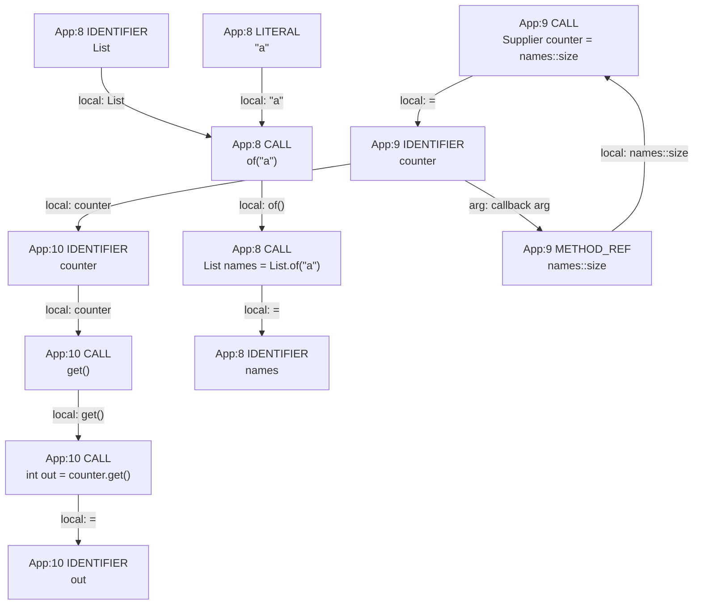

# memberReference: spike value graph

```mermaid
flowchart TD
  n0["App:10 CALL<br/>get()"]
  n1["App:10 CALL<br/>int out = counter.get()"]
  n2["App:10 IDENTIFIER<br/>counter"]
  n3["App:10 IDENTIFIER<br/>out"]
  n4["App:8 CALL<br/>List names = List.of(#quot;a#quot;)"]
  n5["App:8 CALL<br/>of(#quot;a#quot;)"]
  n6["App:8 IDENTIFIER<br/>List"]
  n7["App:8 IDENTIFIER<br/>names"]
  n8["App:8 LITERAL<br/>#quot;a#quot;"]
  n9["App:9 CALL<br/>Supplier counter = names::size"]
  n10["App:9 IDENTIFIER<br/>counter"]
  n11["App:9 METHOD_REF<br/>names::size"]
  n0 -->|"local: get()"| n1
  n1 -->|"local: ="| n3
  n10 -->|"arg: callback arg"| n11
  n10 -->|"local: counter"| n2
  n11 -->|"local: names::size"| n9
  n2 -->|"local: counter"| n0
  n4 -->|"local: ="| n7
  n5 -->|"local: of()"| n4
  n6 -->|"local: List"| n5
  n8 -->|"local: #quot;a#quot;"| n5
  n9 -->|"local: ="| n10
```
