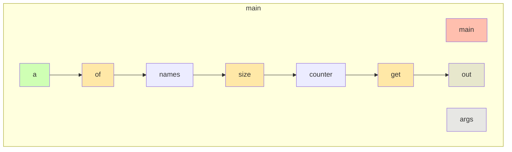

```mermaid
flowchart TD
  subgraph b0["main"]
    n1[main]:::RETURN
    n2[args]:::FUNC_PARAM
    n3["a"]:::LITERAL
    n4[of]:::EXTERNAL
    n5[names]:::OBJ_VARIABLE
    n6[size]:::EXTERNAL
    n7[counter]:::OBJ_VARIABLE
    n8[get]:::EXTERNAL
    n9[out]:::VARIABLE
    n3["a"]:::LITERAL --> n4[of]:::EXTERNAL
    n4[of]:::EXTERNAL --> n5[names]:::OBJ_VARIABLE
    n5[names]:::OBJ_VARIABLE --> n6[size]:::EXTERNAL
    n6[size]:::EXTERNAL --> n7[counter]:::OBJ_VARIABLE
    n7[counter]:::OBJ_VARIABLE --> n8[get]:::EXTERNAL
    n8[get]:::EXTERNAL --> n9[out]:::VARIABLE
  end
  classDef LITERAL fill:#00FF0030
  classDef VARIABLE fill:#80808030
  classDef BIN_OP fill:#80808080
  classDef FUNC_PARAM fill:#8080FF30
  classDef RETURN fill:#FF808080
  classDef EXTERNAL fill:#FFA50040
```
