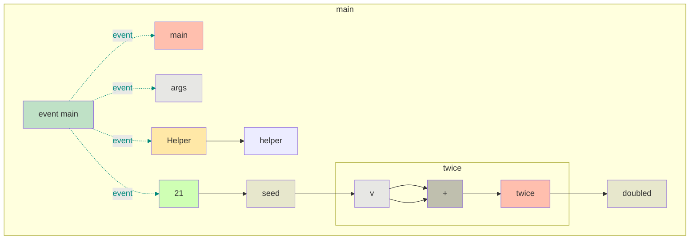

```mermaid
flowchart TD
  subgraph b0["main"]
    n1[event main]:::EVENT
    n2[main]:::RETURN
    n3[args]:::FUNC_PARAM
    n4[Helper]:::EXTERNAL
    n5[helper]:::OBJ_VARIABLE
    n6[21]:::LITERAL
    n7[seed]:::VARIABLE
    n12[doubled]:::VARIABLE
    n1[event main]:::EVENT -. event .-> n2[main]:::RETURN
    n1[event main]:::EVENT -. event .-> n3[args]:::FUNC_PARAM
    n1[event main]:::EVENT -. event .-> n4[Helper]:::EXTERNAL
    n1[event main]:::EVENT -. event .-> n6[21]:::LITERAL
    n4[Helper]:::EXTERNAL --> n5[helper]:::OBJ_VARIABLE
    n6[21]:::LITERAL --> n7[seed]:::VARIABLE
    n7[seed]:::VARIABLE --> n10[v]:::FUNC_PARAM
    n9[twice]:::RETURN --> n12[doubled]:::VARIABLE
    subgraph b8["twice"]
      n9[twice]:::RETURN
      n10[v]:::FUNC_PARAM
      n11[+]:::BIN_OP
      n10[v]:::FUNC_PARAM --> n11[+]:::BIN_OP
      n10[v]:::FUNC_PARAM --> n11[+]:::BIN_OP
      n11[+]:::BIN_OP --> n9[twice]:::RETURN
    end
  end
  linkStyle 0 stroke:#00897b,color:#00897b
  linkStyle 1 stroke:#00897b,color:#00897b
  linkStyle 2 stroke:#00897b,color:#00897b
  linkStyle 3 stroke:#00897b,color:#00897b
  classDef LITERAL fill:#00FF0030
  classDef VARIABLE fill:#80808030
  classDef BIN_OP fill:#80808080
  classDef FUNC_PARAM fill:#8080FF30
  classDef RETURN fill:#FF808080
  classDef EXTERNAL fill:#FFA50040
  classDef UNMODELLED fill:#FF000030,stroke-dasharray: 4 2
  classDef EVENT fill:#00897B40
```
