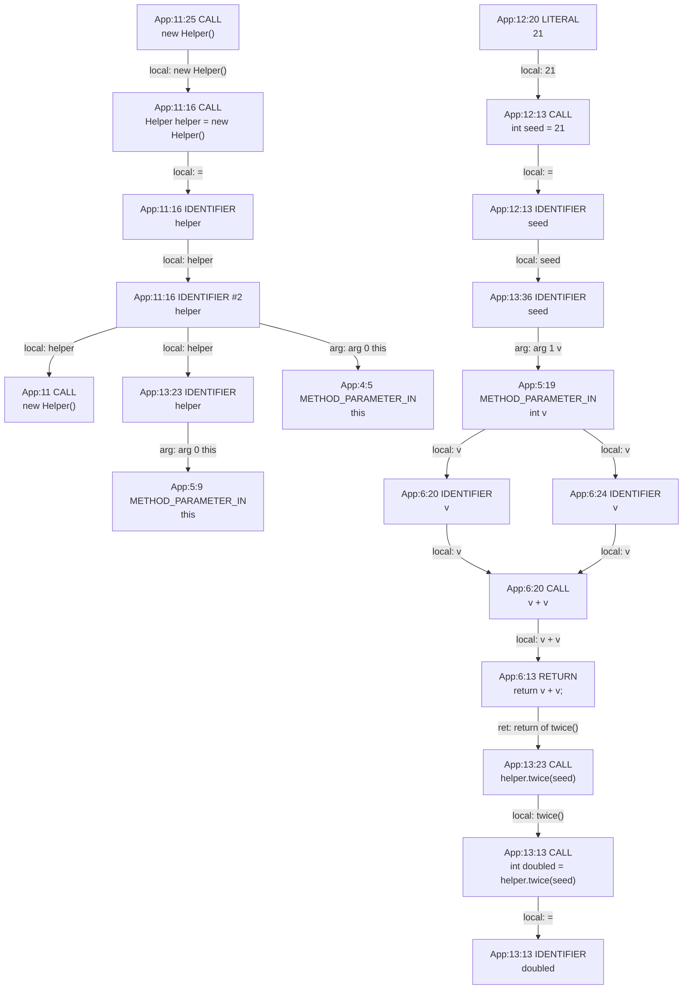

# nestedClass: spike value graph

```mermaid
flowchart TD
  n0["App:11 CALL<br/>new Helper()"]
  n1["App:11:16 CALL<br/>Helper helper = new Helper()"]
  n2["App:11:16 IDENTIFIER #2<br/>helper"]
  n3["App:11:16 IDENTIFIER<br/>helper"]
  n4["App:11:25 CALL<br/>new Helper()"]
  n5["App:12:13 CALL<br/>int seed = 21"]
  n6["App:12:13 IDENTIFIER<br/>seed"]
  n7["App:12:20 LITERAL<br/>21"]
  n8["App:13:13 CALL<br/>int doubled = helper.twice(seed)"]
  n9["App:13:13 IDENTIFIER<br/>doubled"]
  n10["App:13:23 CALL<br/>helper.twice(seed)"]
  n11["App:13:23 IDENTIFIER<br/>helper"]
  n12["App:13:36 IDENTIFIER<br/>seed"]
  n13["App:4:5 METHOD_PARAMETER_IN<br/>this"]
  n14["App:5:19 METHOD_PARAMETER_IN<br/>int v"]
  n15["App:5:9 METHOD_PARAMETER_IN<br/>this"]
  n16["App:6:13 RETURN<br/>return v + v;"]
  n17["App:6:20 CALL<br/>v + v"]
  n18["App:6:20 IDENTIFIER<br/>v"]
  n19["App:6:24 IDENTIFIER<br/>v"]
  n1 -->|"local: ="| n3
  n10 -->|"local: twice()"| n8
  n11 -->|"arg: arg 0 this"| n15
  n12 -->|"arg: arg 1 v"| n14
  n14 -->|"local: v"| n18
  n14 -->|"local: v"| n19
  n16 -->|"ret: return of twice()"| n10
  n17 -->|"local: v + v"| n16
  n18 -->|"local: v"| n17
  n19 -->|"local: v"| n17
  n2 -->|"arg: arg 0 this"| n13
  n2 -->|"local: helper"| n0
  n2 -->|"local: helper"| n11
  n3 -->|"local: helper"| n2
  n4 -->|"local: new Helper()"| n1
  n5 -->|"local: ="| n6
  n6 -->|"local: seed"| n12
  n7 -->|"local: 21"| n5
  n8 -->|"local: ="| n9
```
