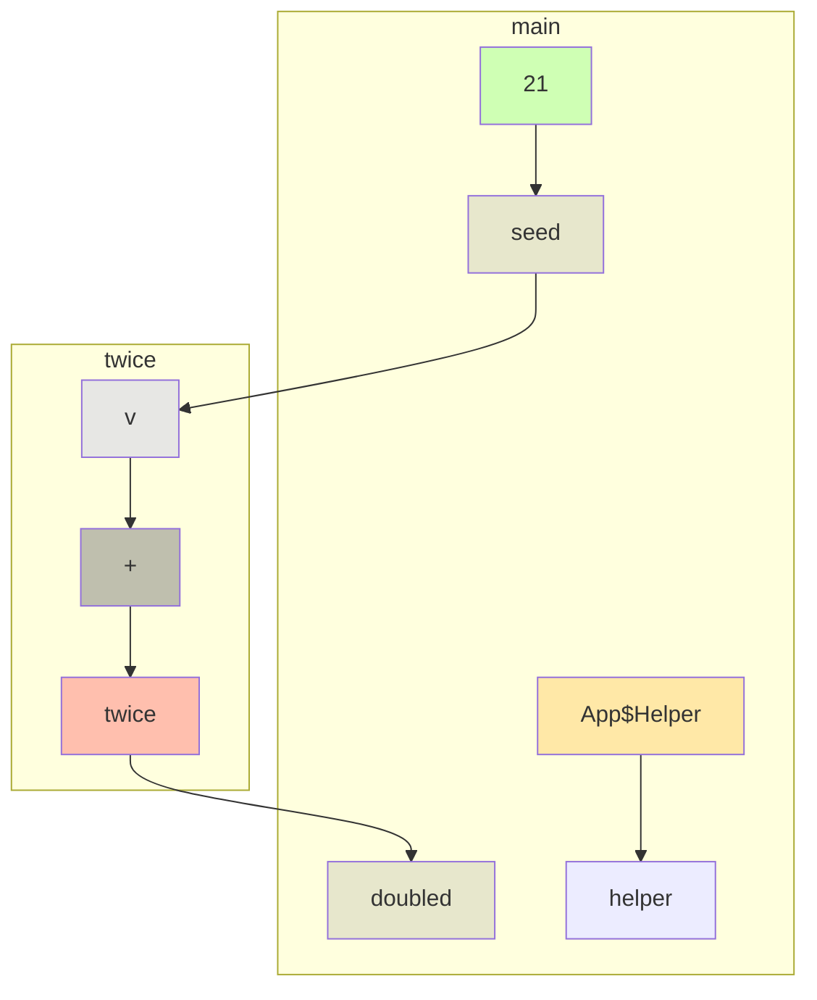

# nestedClass: spike value graph (condensed)

```mermaid
flowchart TD
  subgraph m0["twice"]
    n0["+"]:::BIN_OP
    n1["v"]:::FUNC_PARAM
    n2["twice"]:::RETURN
  end
  subgraph m1["main"]
    n3["App$Helper"]:::EXTERNAL
    n4["21"]:::LITERAL
    n5["doubled"]:::VARIABLE
    n6["helper"]:::OBJ_VARIABLE
    n7["seed"]:::VARIABLE
  end
  n0 --> n2
  n1 --> n0
  n2 --> n5
  n3 --> n6
  n4 --> n7
  n7 --> n1
  classDef LITERAL fill:#00FF0030
  classDef VARIABLE fill:#80808030
  classDef BIN_OP fill:#80808080
  classDef FUNC_PARAM fill:#8080FF30
  classDef RETURN fill:#FF808080
  classDef EXTERNAL fill:#FFA50040
  classDef UNMODELLED fill:#FF000030,stroke-dasharray: 4 2
```
