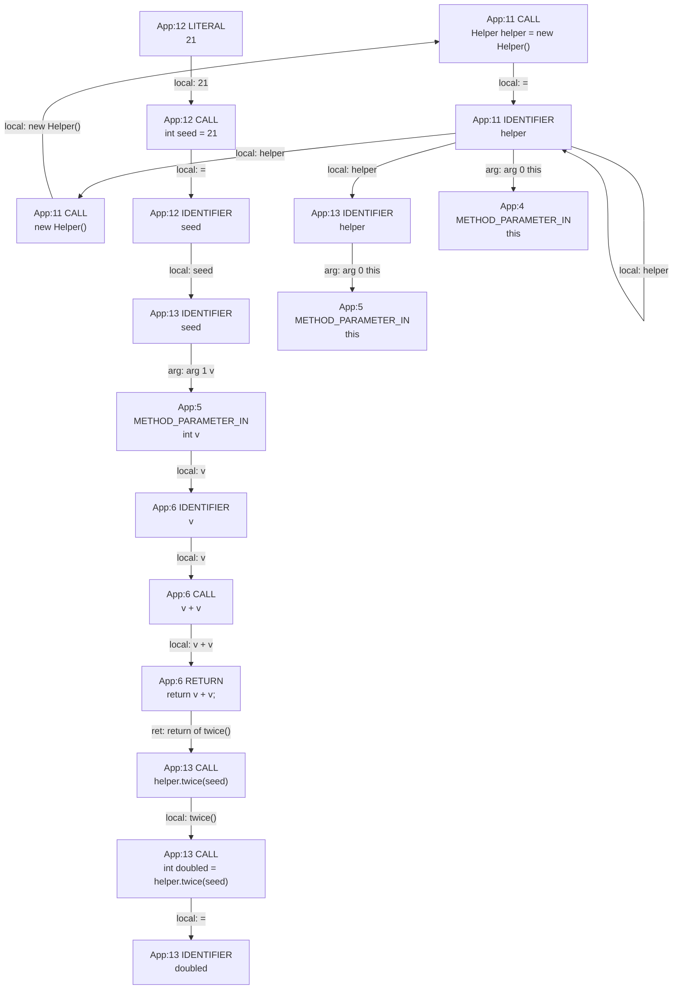

# nestedClass: spike value graph

```mermaid
flowchart TD
  n0["App:11 CALL<br/>Helper helper = new Helper()"]
  n1["App:11 CALL<br/>new Helper()"]
  n2["App:11 IDENTIFIER<br/>helper"]
  n3["App:12 CALL<br/>int seed = 21"]
  n4["App:12 IDENTIFIER<br/>seed"]
  n5["App:12 LITERAL<br/>21"]
  n6["App:13 CALL<br/>helper.twice(seed)"]
  n7["App:13 CALL<br/>int doubled = helper.twice(seed)"]
  n8["App:13 IDENTIFIER<br/>doubled"]
  n9["App:13 IDENTIFIER<br/>helper"]
  n10["App:13 IDENTIFIER<br/>seed"]
  n11["App:4 METHOD_PARAMETER_IN<br/>this"]
  n12["App:5 METHOD_PARAMETER_IN<br/>int v"]
  n13["App:5 METHOD_PARAMETER_IN<br/>this"]
  n14["App:6 CALL<br/>v + v"]
  n15["App:6 IDENTIFIER<br/>v"]
  n16["App:6 RETURN<br/>return v + v;"]
  n0 -->|"local: ="| n2
  n1 -->|"local: new Helper()"| n0
  n10 -->|"arg: arg 1 v"| n12
  n12 -->|"local: v"| n15
  n14 -->|"local: v + v"| n16
  n15 -->|"local: v"| n14
  n16 -->|"ret: return of twice()"| n6
  n2 -->|"arg: arg 0 this"| n11
  n2 -->|"local: helper"| n1
  n2 -->|"local: helper"| n2
  n2 -->|"local: helper"| n9
  n3 -->|"local: ="| n4
  n4 -->|"local: seed"| n10
  n5 -->|"local: 21"| n3
  n6 -->|"local: twice()"| n7
  n7 -->|"local: ="| n8
  n9 -->|"arg: arg 0 this"| n13
```
