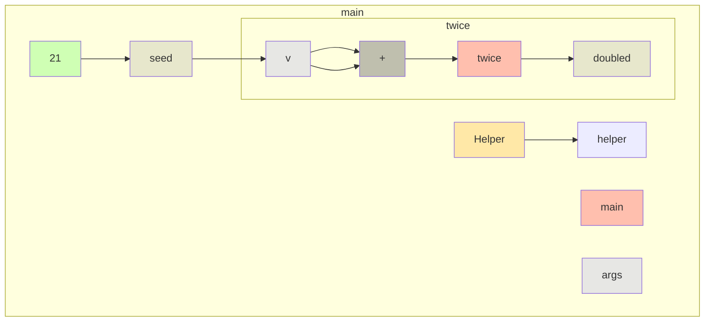

```mermaid
flowchart TD
  subgraph b0["main"]
    n1[main]:::RETURN
    n2[args]:::FUNC_PARAM
    n3[Helper]:::EXTERNAL
    n4[helper]:::OBJ_VARIABLE
    n5[21]:::LITERAL
    n6[seed]:::VARIABLE
    n11[doubled]:::VARIABLE
    n3[Helper]:::EXTERNAL --> n4[helper]:::OBJ_VARIABLE
    n5[21]:::LITERAL --> n6[seed]:::VARIABLE
    n6[seed]:::VARIABLE --> n9[v]:::FUNC_PARAM
    subgraph b7["twice"]
      n8[twice]:::RETURN
      n9[v]:::FUNC_PARAM
      n10[+]:::BIN_OP
      n8[twice]:::RETURN --> n11[doubled]:::VARIABLE
      n9[v]:::FUNC_PARAM --> n10[+]:::BIN_OP
      n9[v]:::FUNC_PARAM --> n10[+]:::BIN_OP
      n10[+]:::BIN_OP --> n8[twice]:::RETURN
    end
  end
  classDef LITERAL fill:#00FF0030
  classDef VARIABLE fill:#80808030
  classDef BIN_OP fill:#80808080
  classDef FUNC_PARAM fill:#8080FF30
  classDef RETURN fill:#FF808080
  classDef EXTERNAL fill:#FFA50040
  classDef UNMODELLED fill:#FF000030,stroke-dasharray: 4 2
```
