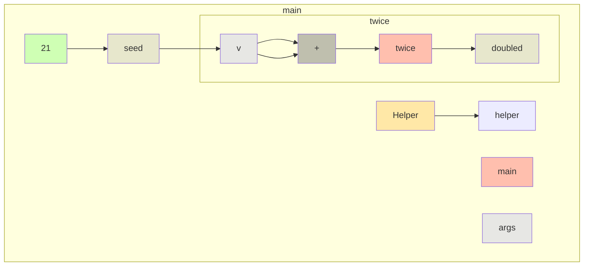

```mermaid
flowchart TD
  subgraph b0["main"]
    n1[main]:::RETURN
    n2[args]:::FUNC_PARAM
    n3[helper]:::OBJ_VARIABLE
    n4[Helper]:::EXTERNAL
    n5[seed]:::VARIABLE
    n6[21]:::LITERAL
    n7[doubled]:::VARIABLE
    n4[Helper]:::EXTERNAL --> n3[helper]:::OBJ_VARIABLE
    n5[seed]:::VARIABLE --> n10[v]:::FUNC_PARAM
    n6[21]:::LITERAL --> n5[seed]:::VARIABLE
    subgraph b8["twice"]
      n9[twice]:::RETURN
      n10[v]:::FUNC_PARAM
      n11[+]:::BIN_OP
      n9[twice]:::RETURN --> n7[doubled]:::VARIABLE
      n10[v]:::FUNC_PARAM --> n11[+]:::BIN_OP
      n10[v]:::FUNC_PARAM --> n11[+]:::BIN_OP
      n11[+]:::BIN_OP --> n9[twice]:::RETURN
    end
  end
  classDef LITERAL fill:#00FF0030
  classDef VARIABLE fill:#80808030
  classDef BIN_OP fill:#80808080
  classDef FUNC_PARAM fill:#8080FF30
  classDef RETURN fill:#FF808080
  classDef EXTERNAL fill:#FFA50040
```
