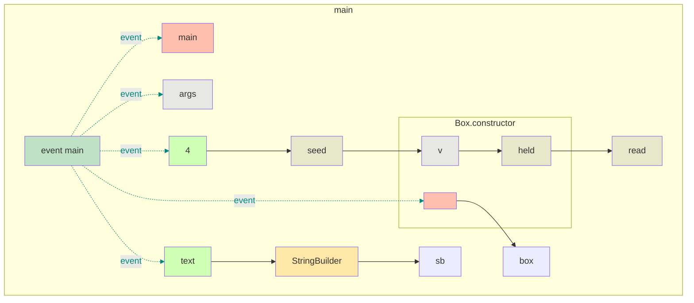

```mermaid
flowchart TD
  subgraph b0["main"]
    n1[event main]:::EVENT
    n2[main]:::RETURN
    n3[args]:::FUNC_PARAM
    n4[4]:::LITERAL
    n5[seed]:::VARIABLE
    n10[box]:::OBJ_VARIABLE
    n11["text"]:::LITERAL
    n12[StringBuilder]:::EXTERNAL
    n13[sb]:::OBJ_VARIABLE
    n14[read]:::VARIABLE
    n1[event main]:::EVENT -. event .-> n2[main]:::RETURN
    n1[event main]:::EVENT -. event .-> n3[args]:::FUNC_PARAM
    n1[event main]:::EVENT -. event .-> n4[4]:::LITERAL
    n1[event main]:::EVENT -. event .-> n11["text"]:::LITERAL
    n1[event main]:::EVENT -. event .-> n7[<init>]:::RETURN
    n4[4]:::LITERAL --> n5[seed]:::VARIABLE
    n5[seed]:::VARIABLE --> n8[v]:::FUNC_PARAM
    n11["text"]:::LITERAL --> n12[StringBuilder]:::EXTERNAL
    n12[StringBuilder]:::EXTERNAL --> n13[sb]:::OBJ_VARIABLE
    n7[<init>]:::RETURN --> n10[box]:::OBJ_VARIABLE
    n9[held]:::VARIABLE --> n14[read]:::VARIABLE
    subgraph b6["Box.constructor"]
      n7[<init>]:::RETURN
      n8[v]:::FUNC_PARAM
      n9[held]:::VARIABLE
      n8[v]:::FUNC_PARAM --> n9[held]:::VARIABLE
    end
  end
  linkStyle 0 stroke:#00897b,color:#00897b
  linkStyle 1 stroke:#00897b,color:#00897b
  linkStyle 2 stroke:#00897b,color:#00897b
  linkStyle 3 stroke:#00897b,color:#00897b
  linkStyle 4 stroke:#00897b,color:#00897b
  classDef LITERAL fill:#00FF0030
  classDef VARIABLE fill:#80808030
  classDef BIN_OP fill:#80808080
  classDef FUNC_PARAM fill:#8080FF30
  classDef RETURN fill:#FF808080
  classDef EXTERNAL fill:#FFA50040
  classDef UNMODELLED fill:#FF000030,stroke-dasharray: 4 2
  classDef EVENT fill:#00897B40
```
