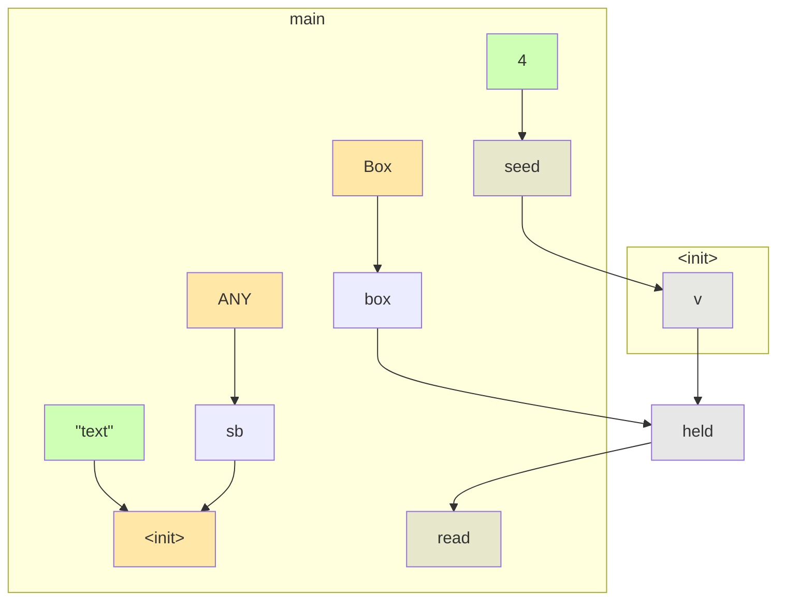

# newObject: spike value graph (condensed)

```mermaid
flowchart TD
  subgraph m0["main"]
    n0["#lt;init#gt;"]:::EXTERNAL
    n1["ANY"]:::EXTERNAL
    n2["Box"]:::EXTERNAL
    n3["#quot;text#quot;"]:::LITERAL
    n4["4"]:::LITERAL
    n5["box"]:::OBJ_VARIABLE
    n6["read"]:::VARIABLE
    n7["sb"]:::OBJ_VARIABLE
    n8["seed"]:::VARIABLE
  end
  subgraph m1["#lt;init#gt;"]
    n9["v"]:::FUNC_PARAM
  end
  n10["held"]:::VARIABLE
  n1 --> n7
  n10 --> n6
  n2 --> n5
  n3 --> n0
  n4 --> n8
  n5 --> n10
  n7 --> n0
  n8 --> n9
  n9 --> n10
  classDef LITERAL fill:#00FF0030
  classDef VARIABLE fill:#80808030
  classDef BIN_OP fill:#80808080
  classDef FUNC_PARAM fill:#8080FF30
  classDef RETURN fill:#FF808080
  classDef EXTERNAL fill:#FFA50040
  classDef UNMODELLED fill:#FF000030,stroke-dasharray: 4 2
```
