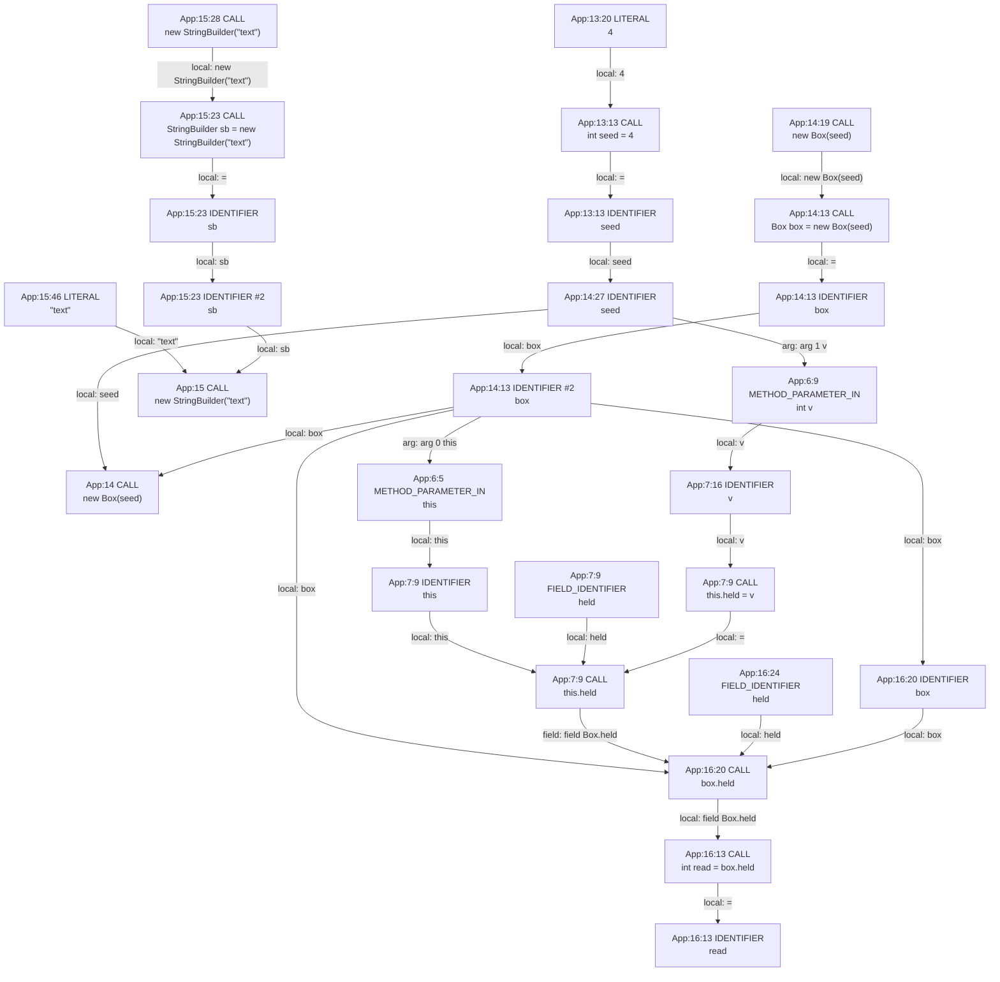

# newObject: spike value graph

```mermaid
flowchart TD
  n0["App:13:13 CALL<br/>int seed = 4"]
  n1["App:13:13 IDENTIFIER<br/>seed"]
  n2["App:13:20 LITERAL<br/>4"]
  n3["App:14 CALL<br/>new Box(seed)"]
  n4["App:14:13 CALL<br/>Box box = new Box(seed)"]
  n5["App:14:13 IDENTIFIER #2<br/>box"]
  n6["App:14:13 IDENTIFIER<br/>box"]
  n7["App:14:19 CALL<br/>new Box(seed)"]
  n8["App:14:27 IDENTIFIER<br/>seed"]
  n9["App:15 CALL<br/>new StringBuilder(#quot;text#quot;)"]
  n10["App:15:23 CALL<br/>StringBuilder sb = new StringBuilder(#quot;text#quot;)"]
  n11["App:15:23 IDENTIFIER #2<br/>sb"]
  n12["App:15:23 IDENTIFIER<br/>sb"]
  n13["App:15:28 CALL<br/>new StringBuilder(#quot;text#quot;)"]
  n14["App:15:46 LITERAL<br/>#quot;text#quot;"]
  n15["App:16:13 CALL<br/>int read = box.held"]
  n16["App:16:13 IDENTIFIER<br/>read"]
  n17["App:16:20 CALL<br/>box.held"]
  n18["App:16:20 IDENTIFIER<br/>box"]
  n19["App:16:24 FIELD_IDENTIFIER<br/>held"]
  n20["App:6:5 METHOD_PARAMETER_IN<br/>this"]
  n21["App:6:9 METHOD_PARAMETER_IN<br/>int v"]
  n22["App:7:16 IDENTIFIER<br/>v"]
  n23["App:7:9 CALL<br/>this.held"]
  n24["App:7:9 CALL<br/>this.held = v"]
  n25["App:7:9 FIELD_IDENTIFIER<br/>held"]
  n26["App:7:9 IDENTIFIER<br/>this"]
  n0 -->|"local: ="| n1
  n1 -->|"local: seed"| n8
  n10 -->|"local: ="| n12
  n11 -->|"local: sb"| n9
  n12 -->|"local: sb"| n11
  n13 -->|"local: new StringBuilder(#quot;text#quot;)"| n10
  n14 -->|"local: #quot;text#quot;"| n9
  n15 -->|"local: ="| n16
  n17 -->|"local: field Box.held"| n15
  n18 -->|"local: box"| n17
  n19 -->|"local: held"| n17
  n2 -->|"local: 4"| n0
  n20 -->|"local: this"| n26
  n21 -->|"local: v"| n22
  n22 -->|"local: v"| n24
  n23 -->|"field: field Box.held"| n17
  n24 -->|"local: ="| n23
  n25 -->|"local: held"| n23
  n26 -->|"local: this"| n23
  n4 -->|"local: ="| n6
  n5 -->|"arg: arg 0 this"| n20
  n5 -->|"local: box"| n17
  n5 -->|"local: box"| n18
  n5 -->|"local: box"| n3
  n6 -->|"local: box"| n5
  n7 -->|"local: new Box(seed)"| n4
  n8 -->|"arg: arg 1 v"| n21
  n8 -->|"local: seed"| n3
```
