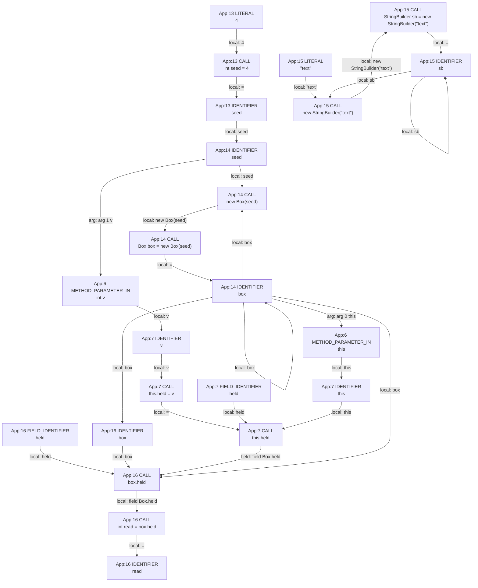

# newObject: spike value graph

```mermaid
flowchart TD
  n0["App:13 CALL<br/>int seed = 4"]
  n1["App:13 IDENTIFIER<br/>seed"]
  n2["App:13 LITERAL<br/>4"]
  n3["App:14 CALL<br/>Box box = new Box(seed)"]
  n4["App:14 CALL<br/>new Box(seed)"]
  n5["App:14 IDENTIFIER<br/>box"]
  n6["App:14 IDENTIFIER<br/>seed"]
  n7["App:15 CALL<br/>StringBuilder sb = new StringBuilder(#quot;text#quot;)"]
  n8["App:15 CALL<br/>new StringBuilder(#quot;text#quot;)"]
  n9["App:15 IDENTIFIER<br/>sb"]
  n10["App:15 LITERAL<br/>#quot;text#quot;"]
  n11["App:16 CALL<br/>box.held"]
  n12["App:16 CALL<br/>int read = box.held"]
  n13["App:16 FIELD_IDENTIFIER<br/>held"]
  n14["App:16 IDENTIFIER<br/>box"]
  n15["App:16 IDENTIFIER<br/>read"]
  n16["App:6 METHOD_PARAMETER_IN<br/>int v"]
  n17["App:6 METHOD_PARAMETER_IN<br/>this"]
  n18["App:7 CALL<br/>this.held"]
  n19["App:7 CALL<br/>this.held = v"]
  n20["App:7 FIELD_IDENTIFIER<br/>held"]
  n21["App:7 IDENTIFIER<br/>this"]
  n22["App:7 IDENTIFIER<br/>v"]
  n0 -->|"local: ="| n1
  n1 -->|"local: seed"| n6
  n10 -->|"local: #quot;text#quot;"| n8
  n11 -->|"local: field Box.held"| n12
  n12 -->|"local: ="| n15
  n13 -->|"local: held"| n11
  n14 -->|"local: box"| n11
  n16 -->|"local: v"| n22
  n17 -->|"local: this"| n21
  n18 -->|"field: field Box.held"| n11
  n19 -->|"local: ="| n18
  n2 -->|"local: 4"| n0
  n20 -->|"local: held"| n18
  n21 -->|"local: this"| n18
  n22 -->|"local: v"| n19
  n3 -->|"local: ="| n5
  n4 -->|"local: new Box(seed)"| n3
  n5 -->|"arg: arg 0 this"| n17
  n5 -->|"local: box"| n11
  n5 -->|"local: box"| n14
  n5 -->|"local: box"| n4
  n5 -->|"local: box"| n5
  n6 -->|"arg: arg 1 v"| n16
  n6 -->|"local: seed"| n4
  n7 -->|"local: ="| n9
  n8 -->|"local: new StringBuilder(#quot;text#quot;)"| n7
  n9 -->|"local: sb"| n8
  n9 -->|"local: sb"| n9
```
