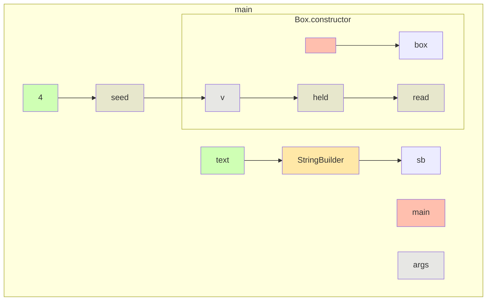

```mermaid
flowchart TD
  subgraph b0["main"]
    n1[main]:::RETURN
    n2[args]:::FUNC_PARAM
    n3[seed]:::VARIABLE
    n4[4]:::LITERAL
    n5[box]:::OBJ_VARIABLE
    n10[sb]:::OBJ_VARIABLE
    n11["text"]:::LITERAL
    n12[StringBuilder]:::EXTERNAL
    n13[read]:::VARIABLE
    n3[seed]:::VARIABLE --> n8[v]:::FUNC_PARAM
    n4[4]:::LITERAL --> n3[seed]:::VARIABLE
    n11["text"]:::LITERAL --> n12[StringBuilder]:::EXTERNAL
    n12[StringBuilder]:::EXTERNAL --> n10[sb]:::OBJ_VARIABLE
    subgraph b6["Box.constructor"]
      n7[<init>]:::RETURN
      n8[v]:::FUNC_PARAM
      n9[held]:::VARIABLE
      n7[<init>]:::RETURN --> n5[box]:::OBJ_VARIABLE
      n8[v]:::FUNC_PARAM --> n9[held]:::VARIABLE
      n9[held]:::VARIABLE --> n13[read]:::VARIABLE
    end
  end
  classDef LITERAL fill:#00FF0030
  classDef VARIABLE fill:#80808030
  classDef BIN_OP fill:#80808080
  classDef FUNC_PARAM fill:#8080FF30
  classDef RETURN fill:#FF808080
  classDef EXTERNAL fill:#FFA50040
```
