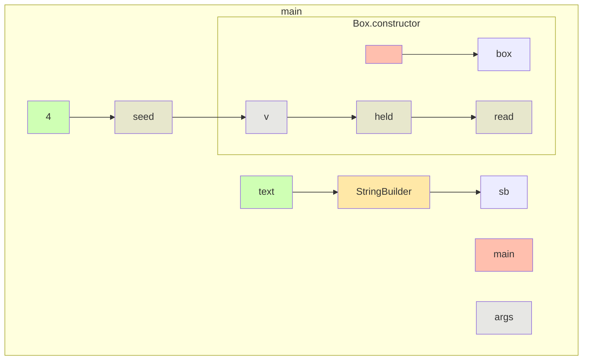

```mermaid
flowchart TD
  subgraph b0["main"]
    n1[main]:::RETURN
    n2[args]:::FUNC_PARAM
    n3[4]:::LITERAL
    n4[seed]:::VARIABLE
    n9[box]:::OBJ_VARIABLE
    n10["text"]:::LITERAL
    n11[StringBuilder]:::EXTERNAL
    n12[sb]:::OBJ_VARIABLE
    n13[read]:::VARIABLE
    n3[4]:::LITERAL --> n4[seed]:::VARIABLE
    n4[seed]:::VARIABLE --> n7[v]:::FUNC_PARAM
    n10["text"]:::LITERAL --> n11[StringBuilder]:::EXTERNAL
    n11[StringBuilder]:::EXTERNAL --> n12[sb]:::OBJ_VARIABLE
    subgraph b5["Box.constructor"]
      n6[<init>]:::RETURN
      n7[v]:::FUNC_PARAM
      n8[held]:::VARIABLE
      n6[<init>]:::RETURN --> n9[box]:::OBJ_VARIABLE
      n7[v]:::FUNC_PARAM --> n8[held]:::VARIABLE
      n8[held]:::VARIABLE --> n13[read]:::VARIABLE
    end
  end
  classDef LITERAL fill:#00FF0030
  classDef VARIABLE fill:#80808030
  classDef BIN_OP fill:#80808080
  classDef FUNC_PARAM fill:#8080FF30
  classDef RETURN fill:#FF808080
  classDef EXTERNAL fill:#FFA50040
  classDef UNMODELLED fill:#FF000030,stroke-dasharray: 4 2
```
