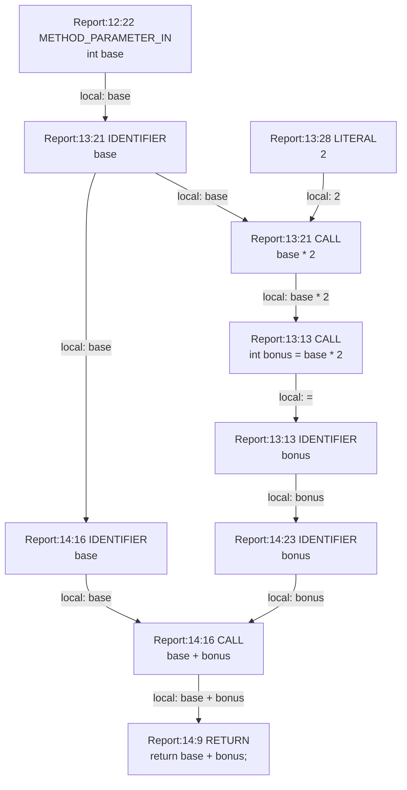

# noMain: spike value graph

```mermaid
flowchart TD
  n0["Report:12:22 METHOD_PARAMETER_IN<br/>int base"]
  n1["Report:13:13 CALL<br/>int bonus = base * 2"]
  n2["Report:13:13 IDENTIFIER<br/>bonus"]
  n3["Report:13:21 CALL<br/>base * 2"]
  n4["Report:13:21 IDENTIFIER<br/>base"]
  n5["Report:13:28 LITERAL<br/>2"]
  n6["Report:14:16 CALL<br/>base + bonus"]
  n7["Report:14:16 IDENTIFIER<br/>base"]
  n8["Report:14:23 IDENTIFIER<br/>bonus"]
  n9["Report:14:9 RETURN<br/>return base + bonus;"]
  n0 -->|"local: base"| n4
  n1 -->|"local: ="| n2
  n2 -->|"local: bonus"| n8
  n3 -->|"local: base * 2"| n1
  n4 -->|"local: base"| n3
  n4 -->|"local: base"| n7
  n5 -->|"local: 2"| n3
  n6 -->|"local: base + bonus"| n9
  n7 -->|"local: base"| n6
  n8 -->|"local: bonus"| n6
```
