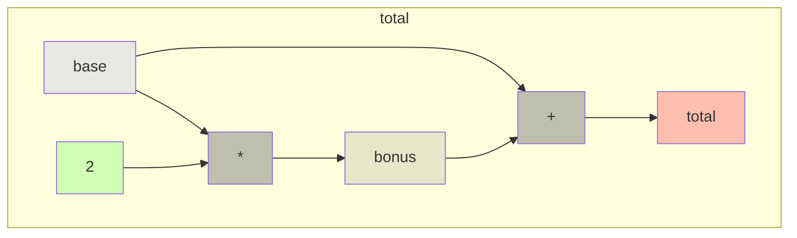

# noMain: spike value graph (condensed)

```mermaid
flowchart TD
  subgraph m0["total"]
    n0["*"]:::BIN_OP
    n1["+"]:::BIN_OP
    n2["base"]:::FUNC_PARAM
    n3["2"]:::LITERAL
    n4["total"]:::RETURN
    n5["bonus"]:::VARIABLE
  end
  n0 --> n5
  n1 --> n4
  n2 --> n0
  n2 --> n1
  n3 --> n0
  n5 --> n1
  classDef LITERAL fill:#00FF0030
  classDef VARIABLE fill:#80808030
  classDef BIN_OP fill:#80808080
  classDef FUNC_PARAM fill:#8080FF30
  classDef RETURN fill:#FF808080
  classDef EXTERNAL fill:#FFA50040
  classDef UNMODELLED fill:#FF000030,stroke-dasharray: 4 2
```
