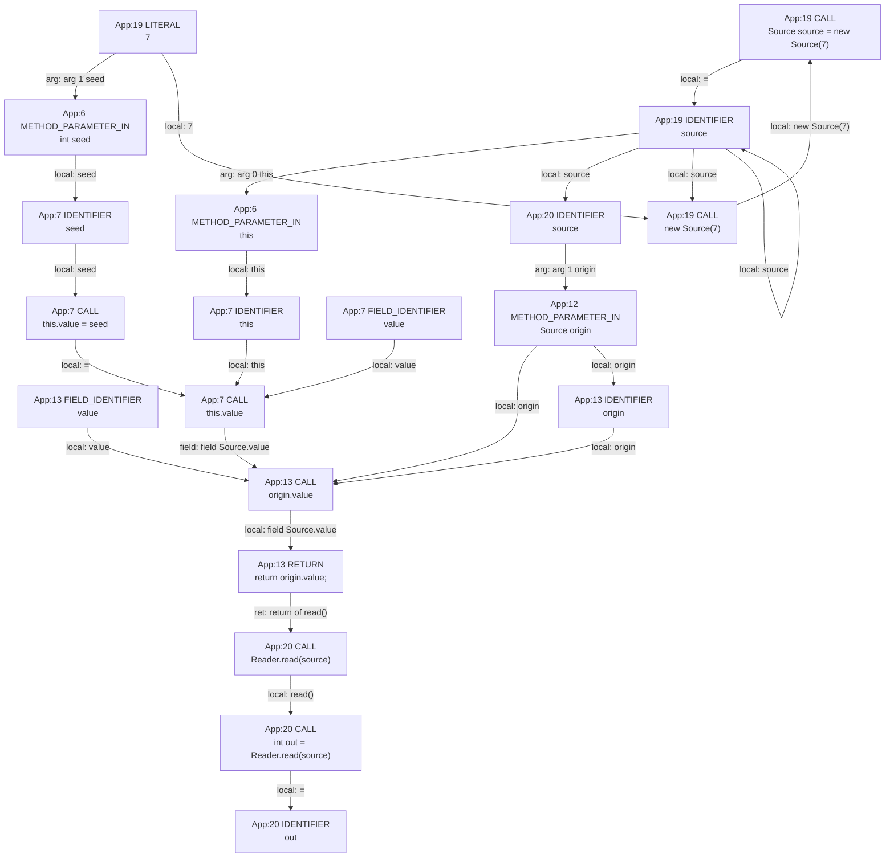

# objectArgument: spike value graph

```mermaid
flowchart TD
  n0["App:12 METHOD_PARAMETER_IN<br/>Source origin"]
  n1["App:13 CALL<br/>origin.value"]
  n2["App:13 FIELD_IDENTIFIER<br/>value"]
  n3["App:13 IDENTIFIER<br/>origin"]
  n4["App:13 RETURN<br/>return origin.value;"]
  n5["App:19 CALL<br/>Source source = new Source(7)"]
  n6["App:19 CALL<br/>new Source(7)"]
  n7["App:19 IDENTIFIER<br/>source"]
  n8["App:19 LITERAL<br/>7"]
  n9["App:20 CALL<br/>Reader.read(source)"]
  n10["App:20 CALL<br/>int out = Reader.read(source)"]
  n11["App:20 IDENTIFIER<br/>out"]
  n12["App:20 IDENTIFIER<br/>source"]
  n13["App:6 METHOD_PARAMETER_IN<br/>int seed"]
  n14["App:6 METHOD_PARAMETER_IN<br/>this"]
  n15["App:7 CALL<br/>this.value"]
  n16["App:7 CALL<br/>this.value = seed"]
  n17["App:7 FIELD_IDENTIFIER<br/>value"]
  n18["App:7 IDENTIFIER<br/>seed"]
  n19["App:7 IDENTIFIER<br/>this"]
  n0 -->|"local: origin"| n1
  n0 -->|"local: origin"| n3
  n1 -->|"local: field Source.value"| n4
  n10 -->|"local: ="| n11
  n12 -->|"arg: arg 1 origin"| n0
  n13 -->|"local: seed"| n18
  n14 -->|"local: this"| n19
  n15 -->|"field: field Source.value"| n1
  n16 -->|"local: ="| n15
  n17 -->|"local: value"| n15
  n18 -->|"local: seed"| n16
  n19 -->|"local: this"| n15
  n2 -->|"local: value"| n1
  n3 -->|"local: origin"| n1
  n4 -->|"ret: return of read()"| n9
  n5 -->|"local: ="| n7
  n6 -->|"local: new Source(7)"| n5
  n7 -->|"arg: arg 0 this"| n14
  n7 -->|"local: source"| n12
  n7 -->|"local: source"| n6
  n7 -->|"local: source"| n7
  n8 -->|"arg: arg 1 seed"| n13
  n8 -->|"local: 7"| n6
  n9 -->|"local: read()"| n10
```
