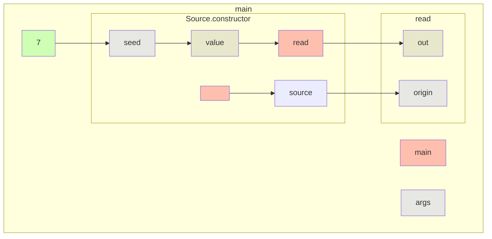

```mermaid
flowchart TD
  subgraph b0["main"]
    n1[main]:::RETURN
    n2[args]:::FUNC_PARAM
    n3[source]:::OBJ_VARIABLE
    n4[7]:::LITERAL
    n9[out]:::VARIABLE
    n3[source]:::OBJ_VARIABLE --> n12[origin]:::FUNC_PARAM
    n4[7]:::LITERAL --> n7[seed]:::FUNC_PARAM
    subgraph b5["Source.constructor"]
      n6[<init>]:::RETURN
      n7[seed]:::FUNC_PARAM
      n8[value]:::VARIABLE
      n6[<init>]:::RETURN --> n3[source]:::OBJ_VARIABLE
      n7[seed]:::FUNC_PARAM --> n8[value]:::VARIABLE
      n8[value]:::VARIABLE --> n11[read]:::RETURN
    end
    subgraph b10["read"]
      n11[read]:::RETURN
      n12[origin]:::FUNC_PARAM
      n11[read]:::RETURN --> n9[out]:::VARIABLE
    end
  end
  classDef LITERAL fill:#00FF0030
  classDef VARIABLE fill:#80808030
  classDef BIN_OP fill:#80808080
  classDef FUNC_PARAM fill:#8080FF30
  classDef RETURN fill:#FF808080
  classDef EXTERNAL fill:#FFA50040
```
