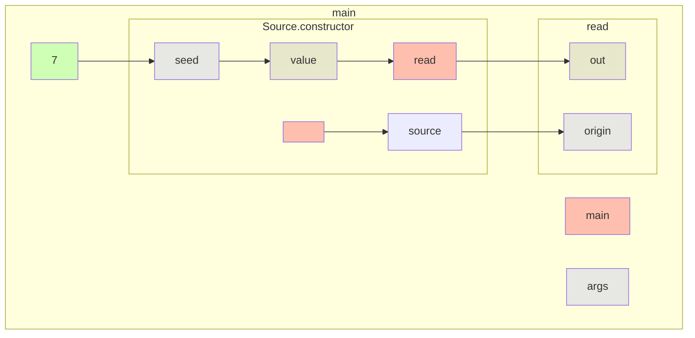

```mermaid
flowchart TD
  subgraph b0["main"]
    n1[main]:::RETURN
    n2[args]:::FUNC_PARAM
    n3[7]:::LITERAL
    n8[source]:::OBJ_VARIABLE
    n12[out]:::VARIABLE
    n3[7]:::LITERAL --> n6[seed]:::FUNC_PARAM
    n8[source]:::OBJ_VARIABLE --> n11[origin]:::FUNC_PARAM
    subgraph b4["Source.constructor"]
      n5[<init>]:::RETURN
      n6[seed]:::FUNC_PARAM
      n7[value]:::VARIABLE
      n5[<init>]:::RETURN --> n8[source]:::OBJ_VARIABLE
      n6[seed]:::FUNC_PARAM --> n7[value]:::VARIABLE
      n7[value]:::VARIABLE --> n10[read]:::RETURN
    end
    subgraph b9["read"]
      n10[read]:::RETURN
      n11[origin]:::FUNC_PARAM
      n10[read]:::RETURN --> n12[out]:::VARIABLE
    end
  end
  classDef LITERAL fill:#00FF0030
  classDef VARIABLE fill:#80808030
  classDef BIN_OP fill:#80808080
  classDef FUNC_PARAM fill:#8080FF30
  classDef RETURN fill:#FF808080
  classDef EXTERNAL fill:#FFA50040
```
