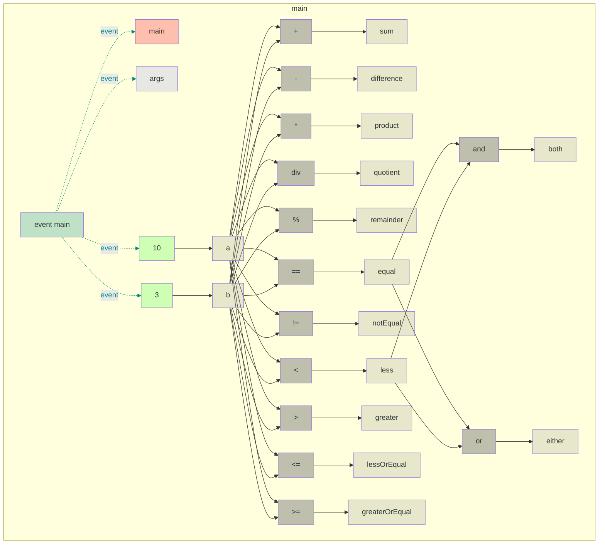

```mermaid
flowchart TD
  subgraph b0["main"]
    n1[event main]:::EVENT
    n2[main]:::RETURN
    n3[args]:::FUNC_PARAM
    n4[10]:::LITERAL
    n5[a]:::VARIABLE
    n6[3]:::LITERAL
    n7[b]:::VARIABLE
    n8[+]:::BIN_OP
    n9[sum]:::VARIABLE
    n10[-]:::BIN_OP
    n11[difference]:::VARIABLE
    n12[*]:::BIN_OP
    n13[product]:::VARIABLE
    n14[div]:::BIN_OP
    n15[quotient]:::VARIABLE
    n16[%]:::BIN_OP
    n17[remainder]:::VARIABLE
    n18[==]:::BIN_OP
    n19[equal]:::VARIABLE
    n20[!=]:::BIN_OP
    n21[notEqual]:::VARIABLE
    n22[<]:::BIN_OP
    n23[less]:::VARIABLE
    n24[>]:::BIN_OP
    n25[greater]:::VARIABLE
    n26[<=]:::BIN_OP
    n27[lessOrEqual]:::VARIABLE
    n28[>=]:::BIN_OP
    n29[greaterOrEqual]:::VARIABLE
    n30[and]:::BIN_OP
    n31[both]:::VARIABLE
    n32[or]:::BIN_OP
    n33[either]:::VARIABLE
    n1[event main]:::EVENT -. event .-> n2[main]:::RETURN
    n1[event main]:::EVENT -. event .-> n3[args]:::FUNC_PARAM
    n1[event main]:::EVENT -. event .-> n4[10]:::LITERAL
    n1[event main]:::EVENT -. event .-> n6[3]:::LITERAL
    n4[10]:::LITERAL --> n5[a]:::VARIABLE
    n5[a]:::VARIABLE --> n8[+]:::BIN_OP
    n5[a]:::VARIABLE --> n10[-]:::BIN_OP
    n5[a]:::VARIABLE --> n12[*]:::BIN_OP
    n5[a]:::VARIABLE --> n14[div]:::BIN_OP
    n5[a]:::VARIABLE --> n16[%]:::BIN_OP
    n5[a]:::VARIABLE --> n18[==]:::BIN_OP
    n5[a]:::VARIABLE --> n20[!=]:::BIN_OP
    n5[a]:::VARIABLE --> n22[<]:::BIN_OP
    n5[a]:::VARIABLE --> n24[>]:::BIN_OP
    n5[a]:::VARIABLE --> n26[<=]:::BIN_OP
    n5[a]:::VARIABLE --> n28[>=]:::BIN_OP
    n6[3]:::LITERAL --> n7[b]:::VARIABLE
    n7[b]:::VARIABLE --> n8[+]:::BIN_OP
    n7[b]:::VARIABLE --> n10[-]:::BIN_OP
    n7[b]:::VARIABLE --> n12[*]:::BIN_OP
    n7[b]:::VARIABLE --> n14[div]:::BIN_OP
    n7[b]:::VARIABLE --> n16[%]:::BIN_OP
    n7[b]:::VARIABLE --> n18[==]:::BIN_OP
    n7[b]:::VARIABLE --> n20[!=]:::BIN_OP
    n7[b]:::VARIABLE --> n22[<]:::BIN_OP
    n7[b]:::VARIABLE --> n24[>]:::BIN_OP
    n7[b]:::VARIABLE --> n26[<=]:::BIN_OP
    n7[b]:::VARIABLE --> n28[>=]:::BIN_OP
    n8[+]:::BIN_OP --> n9[sum]:::VARIABLE
    n10[-]:::BIN_OP --> n11[difference]:::VARIABLE
    n12[*]:::BIN_OP --> n13[product]:::VARIABLE
    n14[div]:::BIN_OP --> n15[quotient]:::VARIABLE
    n16[%]:::BIN_OP --> n17[remainder]:::VARIABLE
    n18[==]:::BIN_OP --> n19[equal]:::VARIABLE
    n19[equal]:::VARIABLE --> n30[and]:::BIN_OP
    n19[equal]:::VARIABLE --> n32[or]:::BIN_OP
    n20[!=]:::BIN_OP --> n21[notEqual]:::VARIABLE
    n22[<]:::BIN_OP --> n23[less]:::VARIABLE
    n23[less]:::VARIABLE --> n30[and]:::BIN_OP
    n23[less]:::VARIABLE --> n32[or]:::BIN_OP
    n24[>]:::BIN_OP --> n25[greater]:::VARIABLE
    n26[<=]:::BIN_OP --> n27[lessOrEqual]:::VARIABLE
    n28[>=]:::BIN_OP --> n29[greaterOrEqual]:::VARIABLE
    n30[and]:::BIN_OP --> n31[both]:::VARIABLE
    n32[or]:::BIN_OP --> n33[either]:::VARIABLE
  end
  linkStyle 0 stroke:#00897b,color:#00897b
  linkStyle 1 stroke:#00897b,color:#00897b
  linkStyle 2 stroke:#00897b,color:#00897b
  linkStyle 3 stroke:#00897b,color:#00897b
  classDef LITERAL fill:#00FF0030
  classDef VARIABLE fill:#80808030
  classDef BIN_OP fill:#80808080
  classDef FUNC_PARAM fill:#8080FF30
  classDef RETURN fill:#FF808080
  classDef EXTERNAL fill:#FFA50040
  classDef UNMODELLED fill:#FF000030,stroke-dasharray: 4 2
  classDef EVENT fill:#00897B40
```
