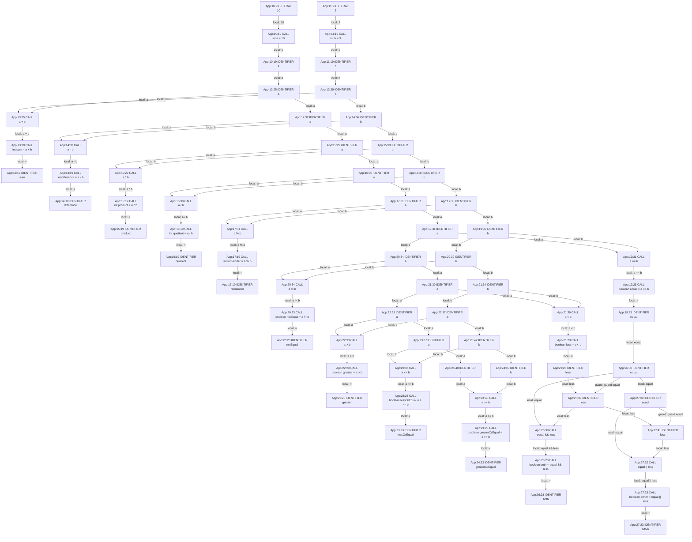

# operators: spike value graph

```mermaid
flowchart TD
  n0["App:10:19 CALL<br/>int a = 10"]
  n1["App:10:19 IDENTIFIER<br/>a"]
  n2["App:10:23 LITERAL<br/>10"]
  n3["App:11:19 CALL<br/>int b = 3"]
  n4["App:11:19 IDENTIFIER<br/>b"]
  n5["App:11:23 LITERAL<br/>3"]
  n6["App:13:19 CALL<br/>int sum = a + b"]
  n7["App:13:19 IDENTIFIER<br/>sum"]
  n8["App:13:25 CALL<br/>a + b"]
  n9["App:13:25 IDENTIFIER<br/>a"]
  n10["App:13:29 IDENTIFIER<br/>b"]
  n11["App:14:19 CALL<br/>int difference = a - b"]
  n12["App:14:19 IDENTIFIER<br/>difference"]
  n13["App:14:32 CALL<br/>a - b"]
  n14["App:14:32 IDENTIFIER<br/>a"]
  n15["App:14:36 IDENTIFIER<br/>b"]
  n16["App:15:19 CALL<br/>int product = a * b"]
  n17["App:15:19 IDENTIFIER<br/>product"]
  n18["App:15:29 CALL<br/>a * b"]
  n19["App:15:29 IDENTIFIER<br/>a"]
  n20["App:15:33 IDENTIFIER<br/>b"]
  n21["App:16:19 CALL<br/>int quotient = a / b"]
  n22["App:16:19 IDENTIFIER<br/>quotient"]
  n23["App:16:30 CALL<br/>a / b"]
  n24["App:16:30 IDENTIFIER<br/>a"]
  n25["App:16:34 IDENTIFIER<br/>b"]
  n26["App:17:19 CALL<br/>int remainder = a % b"]
  n27["App:17:19 IDENTIFIER<br/>remainder"]
  n28["App:17:31 CALL<br/>a % b"]
  n29["App:17:31 IDENTIFIER<br/>a"]
  n30["App:17:35 IDENTIFIER<br/>b"]
  n31["App:19:23 CALL<br/>boolean equal = a == b"]
  n32["App:19:23 IDENTIFIER<br/>equal"]
  n33["App:19:31 CALL<br/>a == b"]
  n34["App:19:31 IDENTIFIER<br/>a"]
  n35["App:19:36 IDENTIFIER<br/>b"]
  n36["App:20:23 CALL<br/>boolean notEqual = a != b"]
  n37["App:20:23 IDENTIFIER<br/>notEqual"]
  n38["App:20:34 CALL<br/>a != b"]
  n39["App:20:34 IDENTIFIER<br/>a"]
  n40["App:20:39 IDENTIFIER<br/>b"]
  n41["App:21:23 CALL<br/>boolean less = a #lt; b"]
  n42["App:21:23 IDENTIFIER<br/>less"]
  n43["App:21:30 CALL<br/>a #lt; b"]
  n44["App:21:30 IDENTIFIER<br/>a"]
  n45["App:21:34 IDENTIFIER<br/>b"]
  n46["App:22:23 CALL<br/>boolean greater = a #gt; b"]
  n47["App:22:23 IDENTIFIER<br/>greater"]
  n48["App:22:33 CALL<br/>a #gt; b"]
  n49["App:22:33 IDENTIFIER<br/>a"]
  n50["App:22:37 IDENTIFIER<br/>b"]
  n51["App:23:23 CALL<br/>boolean lessOrEqual = a #lt;= b"]
  n52["App:23:23 IDENTIFIER<br/>lessOrEqual"]
  n53["App:23:37 CALL<br/>a #lt;= b"]
  n54["App:23:37 IDENTIFIER<br/>a"]
  n55["App:23:42 IDENTIFIER<br/>b"]
  n56["App:24:23 CALL<br/>boolean greaterOrEqual = a #gt;= b"]
  n57["App:24:23 IDENTIFIER<br/>greaterOrEqual"]
  n58["App:24:40 CALL<br/>a #gt;= b"]
  n59["App:24:40 IDENTIFIER<br/>a"]
  n60["App:24:45 IDENTIFIER<br/>b"]
  n61["App:26:23 CALL<br/>boolean both = equal && less"]
  n62["App:26:23 IDENTIFIER<br/>both"]
  n63["App:26:30 CALL<br/>equal && less"]
  n64["App:26:30 IDENTIFIER<br/>equal"]
  n65["App:26:39 IDENTIFIER<br/>less"]
  n66["App:27:23 CALL<br/>boolean either = equal || less"]
  n67["App:27:23 IDENTIFIER<br/>either"]
  n68["App:27:32 CALL<br/>equal || less"]
  n69["App:27:32 IDENTIFIER<br/>equal"]
  n70["App:27:41 IDENTIFIER<br/>less"]
  n0 -->|"local: ="| n1
  n1 -->|"local: a"| n9
  n10 -->|"local: b"| n15
  n10 -->|"local: b"| n8
  n11 -->|"local: ="| n12
  n13 -->|"local: a - b"| n11
  n14 -->|"local: a"| n13
  n14 -->|"local: a"| n19
  n15 -->|"local: b"| n13
  n15 -->|"local: b"| n20
  n16 -->|"local: ="| n17
  n18 -->|"local: a * b"| n16
  n19 -->|"local: a"| n18
  n19 -->|"local: a"| n24
  n2 -->|"local: 10"| n0
  n20 -->|"local: b"| n18
  n20 -->|"local: b"| n25
  n21 -->|"local: ="| n22
  n23 -->|"local: a / b"| n21
  n24 -->|"local: a"| n23
  n24 -->|"local: a"| n29
  n25 -->|"local: b"| n23
  n25 -->|"local: b"| n30
  n26 -->|"local: ="| n27
  n28 -->|"local: a % b"| n26
  n29 -->|"local: a"| n28
  n29 -->|"local: a"| n34
  n3 -->|"local: ="| n4
  n30 -->|"local: b"| n28
  n30 -->|"local: b"| n35
  n31 -->|"local: ="| n32
  n32 -->|"local: equal"| n64
  n33 -->|"local: a == b"| n31
  n34 -->|"local: a"| n33
  n34 -->|"local: a"| n39
  n35 -->|"local: b"| n33
  n35 -->|"local: b"| n40
  n36 -->|"local: ="| n37
  n38 -->|"local: a != b"| n36
  n39 -->|"local: a"| n38
  n39 -->|"local: a"| n44
  n4 -->|"local: b"| n10
  n40 -->|"local: b"| n38
  n40 -->|"local: b"| n45
  n41 -->|"local: ="| n42
  n42 -->|"local: less"| n65
  n43 -->|"local: a #lt; b"| n41
  n44 -->|"local: a"| n43
  n44 -->|"local: a"| n49
  n45 -->|"local: b"| n43
  n45 -->|"local: b"| n50
  n46 -->|"local: ="| n47
  n48 -->|"local: a #gt; b"| n46
  n49 -->|"local: a"| n48
  n49 -->|"local: a"| n54
  n5 -->|"local: 3"| n3
  n50 -->|"local: b"| n48
  n50 -->|"local: b"| n55
  n51 -->|"local: ="| n52
  n53 -->|"local: a #lt;= b"| n51
  n54 -->|"local: a"| n53
  n54 -->|"local: a"| n59
  n55 -->|"local: b"| n53
  n55 -->|"local: b"| n60
  n56 -->|"local: ="| n57
  n58 -->|"local: a #gt;= b"| n56
  n59 -->|"local: a"| n58
  n6 -->|"local: ="| n7
  n60 -->|"local: b"| n58
  n61 -->|"local: ="| n62
  n63 -->|"local: equal && less"| n61
  n64 -->|"guard: guard equal"| n65
  n64 -->|"local: equal"| n63
  n64 -->|"local: equal"| n69
  n65 -->|"local: less"| n63
  n65 -->|"local: less"| n70
  n66 -->|"local: ="| n67
  n68 -->|"local: equal || less"| n66
  n69 -->|"guard: guard equal"| n70
  n69 -->|"local: equal"| n68
  n70 -->|"local: less"| n68
  n8 -->|"local: a + b"| n6
  n9 -->|"local: a"| n14
  n9 -->|"local: a"| n8
```
