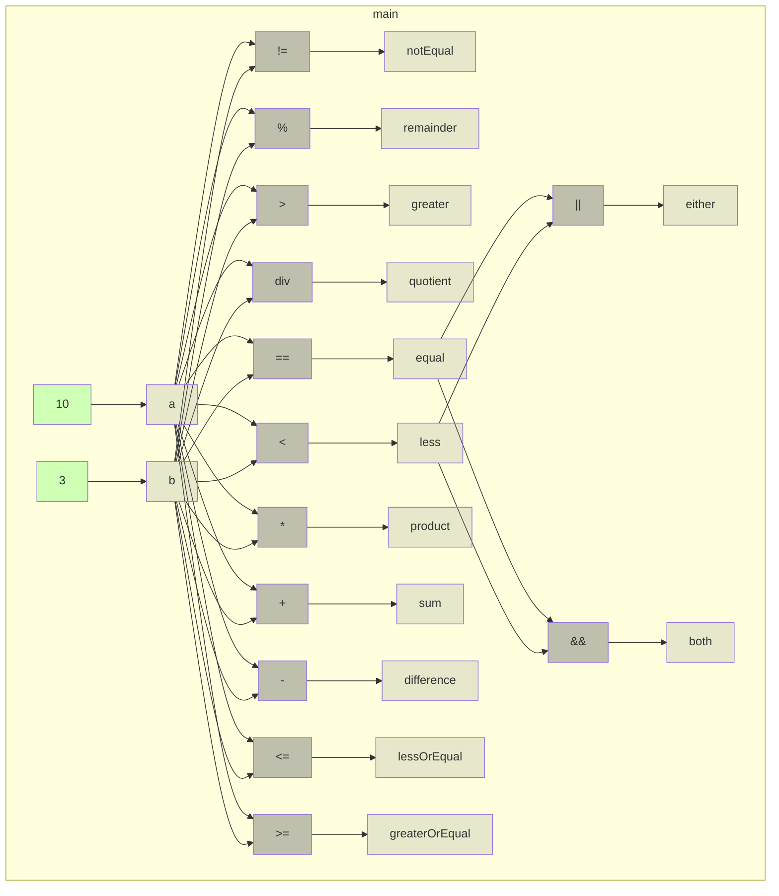

# operators: spike value graph (condensed)

```mermaid
flowchart TD
  subgraph m0["main"]
    n0["!="]:::BIN_OP
    n1["%"]:::BIN_OP
    n2["&&"]:::BIN_OP
    n3["*"]:::BIN_OP
    n4["+"]:::BIN_OP
    n5["-"]:::BIN_OP
    n6["#lt;="]:::BIN_OP
    n7["#lt;"]:::BIN_OP
    n8["=="]:::BIN_OP
    n9["#gt;="]:::BIN_OP
    n10["#gt;"]:::BIN_OP
    n11["div"]:::BIN_OP
    n12["||"]:::BIN_OP
    n13["10"]:::LITERAL
    n14["3"]:::LITERAL
    n15["a"]:::VARIABLE
    n16["both"]:::VARIABLE
    n17["b"]:::VARIABLE
    n18["difference"]:::VARIABLE
    n19["either"]:::VARIABLE
    n20["equal"]:::VARIABLE
    n21["greaterOrEqual"]:::VARIABLE
    n22["greater"]:::VARIABLE
    n23["lessOrEqual"]:::VARIABLE
    n24["less"]:::VARIABLE
    n25["notEqual"]:::VARIABLE
    n26["product"]:::VARIABLE
    n27["quotient"]:::VARIABLE
    n28["remainder"]:::VARIABLE
    n29["sum"]:::VARIABLE
  end
  n0 --> n25
  n1 --> n28
  n10 --> n22
  n11 --> n27
  n12 --> n19
  n13 --> n15
  n14 --> n17
  n15 --> n0
  n15 --> n1
  n15 --> n10
  n15 --> n11
  n15 --> n3
  n15 --> n4
  n15 --> n5
  n15 --> n6
  n15 --> n7
  n15 --> n8
  n15 --> n9
  n17 --> n0
  n17 --> n1
  n17 --> n10
  n17 --> n11
  n17 --> n3
  n17 --> n4
  n17 --> n5
  n17 --> n6
  n17 --> n7
  n17 --> n8
  n17 --> n9
  n2 --> n16
  n20 --> n12
  n20 --> n2
  n24 --> n12
  n24 --> n2
  n3 --> n26
  n4 --> n29
  n5 --> n18
  n6 --> n23
  n7 --> n24
  n8 --> n20
  n9 --> n21
  classDef LITERAL fill:#00FF0030
  classDef VARIABLE fill:#80808030
  classDef BIN_OP fill:#80808080
  classDef FUNC_PARAM fill:#8080FF30
  classDef RETURN fill:#FF808080
  classDef EXTERNAL fill:#FFA50040
  classDef UNMODELLED fill:#FF000030,stroke-dasharray: 4 2
```
