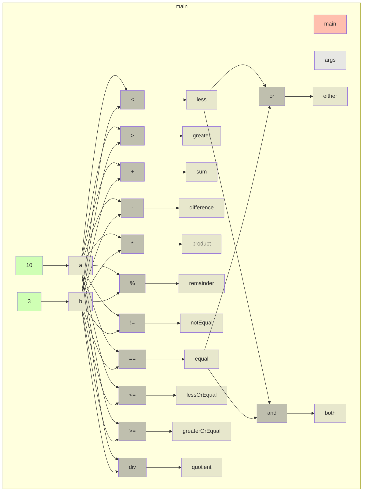

```mermaid
flowchart TD
  subgraph 4309014["main"]
    -32731031541[lessOrEqual]:::VARIABLE
    -22918758106[either]:::VARIABLE
    -15713306450[quotient]:::VARIABLE
    -6031623405[product]:::VARIABLE
    -770680793[a]:::VARIABLE
    -770652813[b]:::VARIABLE
    -770651863[10]:::LITERAL
    -770649021[3]:::LITERAL
    -770620327[+]:::BIN_OP
    -770588522[-]:::BIN_OP
    -770537578[*]:::BIN_OP
    -770475078[%]:::BIN_OP
    -770410772[==]:::BIN_OP
    -770392149[!=]:::BIN_OP
    -769732762[<]:::BIN_OP
    -769700211[>]:::BIN_OP
    -769635059[<=]:::BIN_OP
    -769579203[>=]:::BIN_OP
    -769486196[or]:::BIN_OP
    -768816342[div]:::BIN_OP
    -768683570[sum]:::VARIABLE
    -767936777[and]:::BIN_OP
    -718099776[both]:::VARIABLE
    -713351011[less]:::VARIABLE
    56853577[main]:::RETURN
    719171793[args]:::FUNC_PARAM
    874408300[equal]:::VARIABLE
    4051503566[greater]:::VARIABLE
    5636770002[greaterOrEqual]:::VARIABLE
    14016663398[remainder]:::VARIABLE
    25621328924[notEqual]:::VARIABLE
    28611554366[difference]:::VARIABLE
    -770680793[a]:::VARIABLE --> -770620327[+]:::BIN_OP
    -770680793[a]:::VARIABLE --> -770588522[-]:::BIN_OP
    -770680793[a]:::VARIABLE --> -770537578[*]:::BIN_OP
    -770680793[a]:::VARIABLE --> -768816342[div]:::BIN_OP
    -770680793[a]:::VARIABLE --> -770475078[%]:::BIN_OP
    -770680793[a]:::VARIABLE --> -770410772[==]:::BIN_OP
    -770680793[a]:::VARIABLE --> -770392149[!=]:::BIN_OP
    -770680793[a]:::VARIABLE --> -769732762[<]:::BIN_OP
    -770680793[a]:::VARIABLE --> -769700211[>]:::BIN_OP
    -770680793[a]:::VARIABLE --> -769635059[<=]:::BIN_OP
    -770680793[a]:::VARIABLE --> -769579203[>=]:::BIN_OP
    -770652813[b]:::VARIABLE --> -770620327[+]:::BIN_OP
    -770652813[b]:::VARIABLE --> -770588522[-]:::BIN_OP
    -770652813[b]:::VARIABLE --> -770537578[*]:::BIN_OP
    -770652813[b]:::VARIABLE --> -768816342[div]:::BIN_OP
    -770652813[b]:::VARIABLE --> -770475078[%]:::BIN_OP
    -770652813[b]:::VARIABLE --> -770410772[==]:::BIN_OP
    -770652813[b]:::VARIABLE --> -770392149[!=]:::BIN_OP
    -770652813[b]:::VARIABLE --> -769732762[<]:::BIN_OP
    -770652813[b]:::VARIABLE --> -769700211[>]:::BIN_OP
    -770652813[b]:::VARIABLE --> -769635059[<=]:::BIN_OP
    -770652813[b]:::VARIABLE --> -769579203[>=]:::BIN_OP
    -770651863[10]:::LITERAL --> -770680793[a]:::VARIABLE
    -770649021[3]:::LITERAL --> -770652813[b]:::VARIABLE
    -770620327[+]:::BIN_OP --> -768683570[sum]:::VARIABLE
    -770588522[-]:::BIN_OP --> 28611554366[difference]:::VARIABLE
    -770537578[*]:::BIN_OP --> -6031623405[product]:::VARIABLE
    -770475078[%]:::BIN_OP --> 14016663398[remainder]:::VARIABLE
    -770410772[==]:::BIN_OP --> 874408300[equal]:::VARIABLE
    -770392149[!=]:::BIN_OP --> 25621328924[notEqual]:::VARIABLE
    -769732762[<]:::BIN_OP --> -713351011[less]:::VARIABLE
    -769700211[>]:::BIN_OP --> 4051503566[greater]:::VARIABLE
    -769635059[<=]:::BIN_OP --> -32731031541[lessOrEqual]:::VARIABLE
    -769579203[>=]:::BIN_OP --> 5636770002[greaterOrEqual]:::VARIABLE
    -769486196[or]:::BIN_OP --> -22918758106[either]:::VARIABLE
    -768816342[div]:::BIN_OP --> -15713306450[quotient]:::VARIABLE
    -767936777[and]:::BIN_OP --> -718099776[both]:::VARIABLE
    -713351011[less]:::VARIABLE --> -767936777[and]:::BIN_OP
    -713351011[less]:::VARIABLE --> -769486196[or]:::BIN_OP
    874408300[equal]:::VARIABLE --> -767936777[and]:::BIN_OP
    874408300[equal]:::VARIABLE --> -769486196[or]:::BIN_OP
  end
  classDef LITERAL fill:#00FF0030
  classDef VARIABLE fill:#80808030
  classDef BIN_OP fill:#80808080
  classDef FUNC_PARAM fill:#8080FF30
  classDef RETURN fill:#FF808080
```
