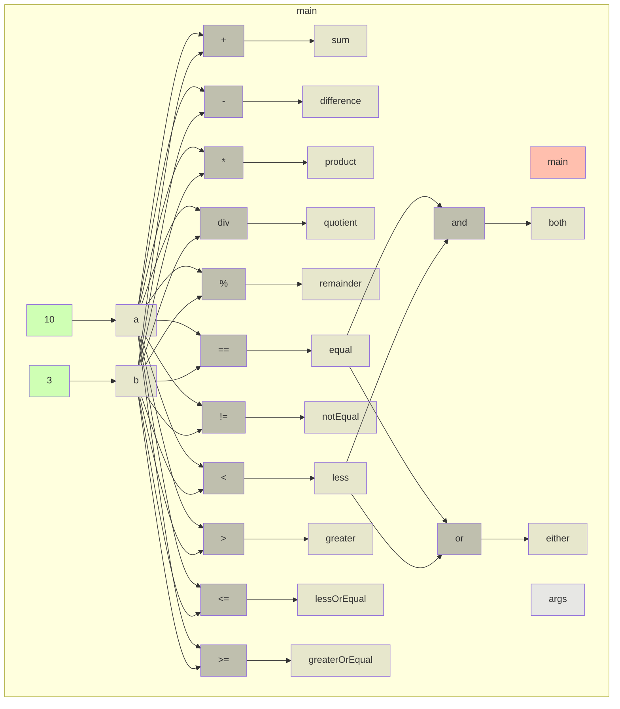

```mermaid
flowchart TD
  subgraph b0["main"]
    n1[main]:::RETURN
    n2[args]:::FUNC_PARAM
    n3[a]:::VARIABLE
    n4[10]:::LITERAL
    n5[b]:::VARIABLE
    n6[3]:::LITERAL
    n7[sum]:::VARIABLE
    n8[+]:::BIN_OP
    n9[difference]:::VARIABLE
    n10[-]:::BIN_OP
    n11[product]:::VARIABLE
    n12[*]:::BIN_OP
    n13[quotient]:::VARIABLE
    n14[div]:::BIN_OP
    n15[remainder]:::VARIABLE
    n16[%]:::BIN_OP
    n17[equal]:::VARIABLE
    n18[==]:::BIN_OP
    n19[notEqual]:::VARIABLE
    n20[!=]:::BIN_OP
    n21[less]:::VARIABLE
    n22[<]:::BIN_OP
    n23[greater]:::VARIABLE
    n24[>]:::BIN_OP
    n25[lessOrEqual]:::VARIABLE
    n26[<=]:::BIN_OP
    n27[greaterOrEqual]:::VARIABLE
    n28[>=]:::BIN_OP
    n29[both]:::VARIABLE
    n30[and]:::BIN_OP
    n31[either]:::VARIABLE
    n32[or]:::BIN_OP
    n3[a]:::VARIABLE --> n8[+]:::BIN_OP
    n3[a]:::VARIABLE --> n10[-]:::BIN_OP
    n3[a]:::VARIABLE --> n12[*]:::BIN_OP
    n3[a]:::VARIABLE --> n14[div]:::BIN_OP
    n3[a]:::VARIABLE --> n16[%]:::BIN_OP
    n3[a]:::VARIABLE --> n18[==]:::BIN_OP
    n3[a]:::VARIABLE --> n20[!=]:::BIN_OP
    n3[a]:::VARIABLE --> n22[<]:::BIN_OP
    n3[a]:::VARIABLE --> n24[>]:::BIN_OP
    n3[a]:::VARIABLE --> n26[<=]:::BIN_OP
    n3[a]:::VARIABLE --> n28[>=]:::BIN_OP
    n4[10]:::LITERAL --> n3[a]:::VARIABLE
    n5[b]:::VARIABLE --> n8[+]:::BIN_OP
    n5[b]:::VARIABLE --> n10[-]:::BIN_OP
    n5[b]:::VARIABLE --> n12[*]:::BIN_OP
    n5[b]:::VARIABLE --> n14[div]:::BIN_OP
    n5[b]:::VARIABLE --> n16[%]:::BIN_OP
    n5[b]:::VARIABLE --> n18[==]:::BIN_OP
    n5[b]:::VARIABLE --> n20[!=]:::BIN_OP
    n5[b]:::VARIABLE --> n22[<]:::BIN_OP
    n5[b]:::VARIABLE --> n24[>]:::BIN_OP
    n5[b]:::VARIABLE --> n26[<=]:::BIN_OP
    n5[b]:::VARIABLE --> n28[>=]:::BIN_OP
    n6[3]:::LITERAL --> n5[b]:::VARIABLE
    n8[+]:::BIN_OP --> n7[sum]:::VARIABLE
    n10[-]:::BIN_OP --> n9[difference]:::VARIABLE
    n12[*]:::BIN_OP --> n11[product]:::VARIABLE
    n14[div]:::BIN_OP --> n13[quotient]:::VARIABLE
    n16[%]:::BIN_OP --> n15[remainder]:::VARIABLE
    n17[equal]:::VARIABLE --> n30[and]:::BIN_OP
    n17[equal]:::VARIABLE --> n32[or]:::BIN_OP
    n18[==]:::BIN_OP --> n17[equal]:::VARIABLE
    n20[!=]:::BIN_OP --> n19[notEqual]:::VARIABLE
    n21[less]:::VARIABLE --> n30[and]:::BIN_OP
    n21[less]:::VARIABLE --> n32[or]:::BIN_OP
    n22[<]:::BIN_OP --> n21[less]:::VARIABLE
    n24[>]:::BIN_OP --> n23[greater]:::VARIABLE
    n26[<=]:::BIN_OP --> n25[lessOrEqual]:::VARIABLE
    n28[>=]:::BIN_OP --> n27[greaterOrEqual]:::VARIABLE
    n30[and]:::BIN_OP --> n29[both]:::VARIABLE
    n32[or]:::BIN_OP --> n31[either]:::VARIABLE
  end
  classDef LITERAL fill:#00FF0030
  classDef VARIABLE fill:#80808030
  classDef BIN_OP fill:#80808080
  classDef FUNC_PARAM fill:#8080FF30
  classDef RETURN fill:#FF808080
  classDef EXTERNAL fill:#FFA50040
```
