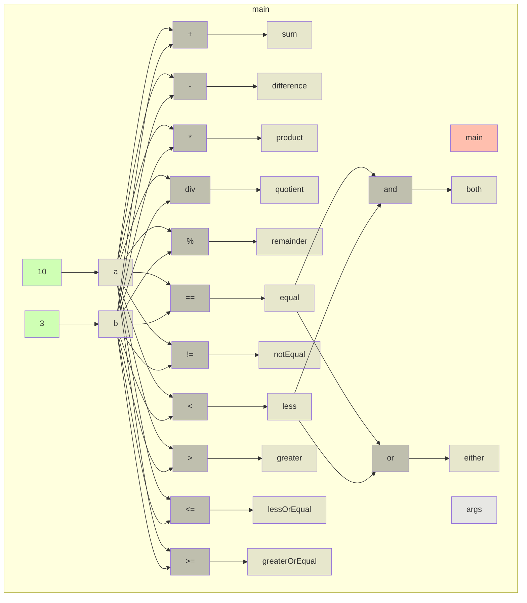

```mermaid
flowchart TD
  subgraph b0["main"]
    n1[main]:::RETURN
    n2[args]:::FUNC_PARAM
    n3[10]:::LITERAL
    n4[a]:::VARIABLE
    n5[3]:::LITERAL
    n6[b]:::VARIABLE
    n7[+]:::BIN_OP
    n8[sum]:::VARIABLE
    n9[-]:::BIN_OP
    n10[difference]:::VARIABLE
    n11[*]:::BIN_OP
    n12[product]:::VARIABLE
    n13[div]:::BIN_OP
    n14[quotient]:::VARIABLE
    n15[%]:::BIN_OP
    n16[remainder]:::VARIABLE
    n17[==]:::BIN_OP
    n18[equal]:::VARIABLE
    n19[!=]:::BIN_OP
    n20[notEqual]:::VARIABLE
    n21[<]:::BIN_OP
    n22[less]:::VARIABLE
    n23[>]:::BIN_OP
    n24[greater]:::VARIABLE
    n25[<=]:::BIN_OP
    n26[lessOrEqual]:::VARIABLE
    n27[>=]:::BIN_OP
    n28[greaterOrEqual]:::VARIABLE
    n29[and]:::BIN_OP
    n30[both]:::VARIABLE
    n31[or]:::BIN_OP
    n32[either]:::VARIABLE
    n3[10]:::LITERAL --> n4[a]:::VARIABLE
    n4[a]:::VARIABLE --> n7[+]:::BIN_OP
    n4[a]:::VARIABLE --> n9[-]:::BIN_OP
    n4[a]:::VARIABLE --> n11[*]:::BIN_OP
    n4[a]:::VARIABLE --> n13[div]:::BIN_OP
    n4[a]:::VARIABLE --> n15[%]:::BIN_OP
    n4[a]:::VARIABLE --> n17[==]:::BIN_OP
    n4[a]:::VARIABLE --> n19[!=]:::BIN_OP
    n4[a]:::VARIABLE --> n21[<]:::BIN_OP
    n4[a]:::VARIABLE --> n23[>]:::BIN_OP
    n4[a]:::VARIABLE --> n25[<=]:::BIN_OP
    n4[a]:::VARIABLE --> n27[>=]:::BIN_OP
    n5[3]:::LITERAL --> n6[b]:::VARIABLE
    n6[b]:::VARIABLE --> n7[+]:::BIN_OP
    n6[b]:::VARIABLE --> n9[-]:::BIN_OP
    n6[b]:::VARIABLE --> n11[*]:::BIN_OP
    n6[b]:::VARIABLE --> n13[div]:::BIN_OP
    n6[b]:::VARIABLE --> n15[%]:::BIN_OP
    n6[b]:::VARIABLE --> n17[==]:::BIN_OP
    n6[b]:::VARIABLE --> n19[!=]:::BIN_OP
    n6[b]:::VARIABLE --> n21[<]:::BIN_OP
    n6[b]:::VARIABLE --> n23[>]:::BIN_OP
    n6[b]:::VARIABLE --> n25[<=]:::BIN_OP
    n6[b]:::VARIABLE --> n27[>=]:::BIN_OP
    n7[+]:::BIN_OP --> n8[sum]:::VARIABLE
    n9[-]:::BIN_OP --> n10[difference]:::VARIABLE
    n11[*]:::BIN_OP --> n12[product]:::VARIABLE
    n13[div]:::BIN_OP --> n14[quotient]:::VARIABLE
    n15[%]:::BIN_OP --> n16[remainder]:::VARIABLE
    n17[==]:::BIN_OP --> n18[equal]:::VARIABLE
    n18[equal]:::VARIABLE --> n29[and]:::BIN_OP
    n18[equal]:::VARIABLE --> n31[or]:::BIN_OP
    n19[!=]:::BIN_OP --> n20[notEqual]:::VARIABLE
    n21[<]:::BIN_OP --> n22[less]:::VARIABLE
    n22[less]:::VARIABLE --> n29[and]:::BIN_OP
    n22[less]:::VARIABLE --> n31[or]:::BIN_OP
    n23[>]:::BIN_OP --> n24[greater]:::VARIABLE
    n25[<=]:::BIN_OP --> n26[lessOrEqual]:::VARIABLE
    n27[>=]:::BIN_OP --> n28[greaterOrEqual]:::VARIABLE
    n29[and]:::BIN_OP --> n30[both]:::VARIABLE
    n31[or]:::BIN_OP --> n32[either]:::VARIABLE
  end
  classDef LITERAL fill:#00FF0030
  classDef VARIABLE fill:#80808030
  classDef BIN_OP fill:#80808080
  classDef FUNC_PARAM fill:#8080FF30
  classDef RETURN fill:#FF808080
  classDef EXTERNAL fill:#FFA50040
```
