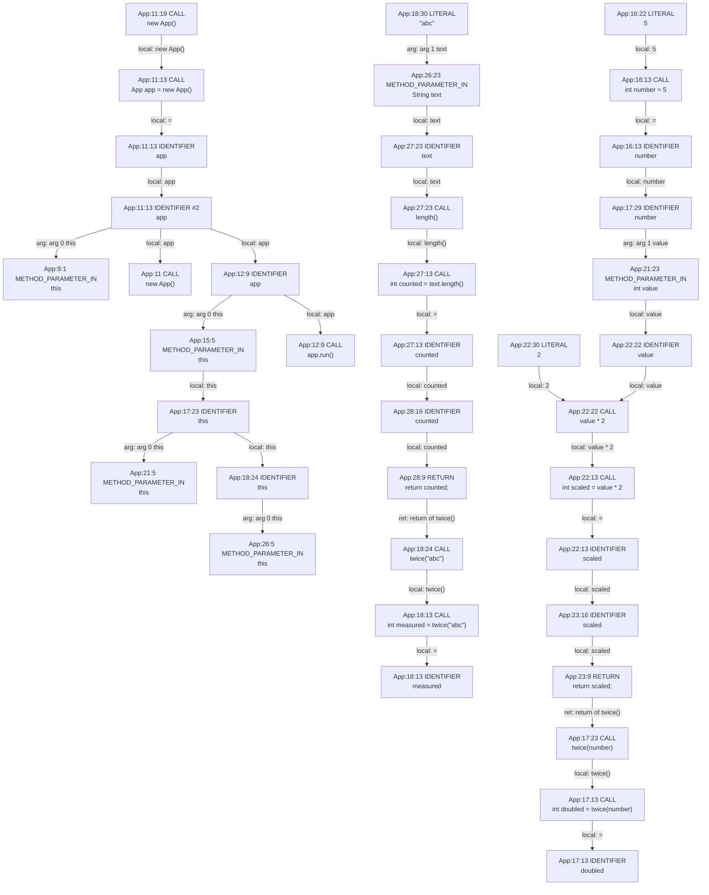

# overload: spike value graph

```mermaid
flowchart TD
  n0["App:11 CALL<br/>new App()"]
  n1["App:11:13 CALL<br/>App app = new App()"]
  n2["App:11:13 IDENTIFIER #2<br/>app"]
  n3["App:11:13 IDENTIFIER<br/>app"]
  n4["App:11:19 CALL<br/>new App()"]
  n5["App:12:9 CALL<br/>app.run()"]
  n6["App:12:9 IDENTIFIER<br/>app"]
  n7["App:15:5 METHOD_PARAMETER_IN<br/>this"]
  n8["App:16:13 CALL<br/>int number = 5"]
  n9["App:16:13 IDENTIFIER<br/>number"]
  n10["App:16:22 LITERAL<br/>5"]
  n11["App:17:13 CALL<br/>int doubled = twice(number)"]
  n12["App:17:13 IDENTIFIER<br/>doubled"]
  n13["App:17:23 CALL<br/>twice(number)"]
  n14["App:17:23 IDENTIFIER<br/>this"]
  n15["App:17:29 IDENTIFIER<br/>number"]
  n16["App:18:13 CALL<br/>int measured = twice(#quot;abc#quot;)"]
  n17["App:18:13 IDENTIFIER<br/>measured"]
  n18["App:18:24 CALL<br/>twice(#quot;abc#quot;)"]
  n19["App:18:24 IDENTIFIER<br/>this"]
  n20["App:18:30 LITERAL<br/>#quot;abc#quot;"]
  n21["App:21:23 METHOD_PARAMETER_IN<br/>int value"]
  n22["App:21:5 METHOD_PARAMETER_IN<br/>this"]
  n23["App:22:13 CALL<br/>int scaled = value * 2"]
  n24["App:22:13 IDENTIFIER<br/>scaled"]
  n25["App:22:22 CALL<br/>value * 2"]
  n26["App:22:22 IDENTIFIER<br/>value"]
  n27["App:22:30 LITERAL<br/>2"]
  n28["App:23:16 IDENTIFIER<br/>scaled"]
  n29["App:23:9 RETURN<br/>return scaled;"]
  n30["App:26:23 METHOD_PARAMETER_IN<br/>String text"]
  n31["App:26:5 METHOD_PARAMETER_IN<br/>this"]
  n32["App:27:13 CALL<br/>int counted = text.length()"]
  n33["App:27:13 IDENTIFIER<br/>counted"]
  n34["App:27:23 CALL<br/>length()"]
  n35["App:27:23 IDENTIFIER<br/>text"]
  n36["App:28:16 IDENTIFIER<br/>counted"]
  n37["App:28:9 RETURN<br/>return counted;"]
  n38["App:9:1 METHOD_PARAMETER_IN<br/>this"]
  n1 -->|"local: ="| n3
  n10 -->|"local: 5"| n8
  n11 -->|"local: ="| n12
  n13 -->|"local: twice()"| n11
  n14 -->|"arg: arg 0 this"| n22
  n14 -->|"local: this"| n19
  n15 -->|"arg: arg 1 value"| n21
  n16 -->|"local: ="| n17
  n18 -->|"local: twice()"| n16
  n19 -->|"arg: arg 0 this"| n31
  n2 -->|"arg: arg 0 this"| n38
  n2 -->|"local: app"| n0
  n2 -->|"local: app"| n6
  n20 -->|"arg: arg 1 text"| n30
  n21 -->|"local: value"| n26
  n23 -->|"local: ="| n24
  n24 -->|"local: scaled"| n28
  n25 -->|"local: value * 2"| n23
  n26 -->|"local: value"| n25
  n27 -->|"local: 2"| n25
  n28 -->|"local: scaled"| n29
  n29 -->|"ret: return of twice()"| n13
  n3 -->|"local: app"| n2
  n30 -->|"local: text"| n35
  n32 -->|"local: ="| n33
  n33 -->|"local: counted"| n36
  n34 -->|"local: length()"| n32
  n35 -->|"local: text"| n34
  n36 -->|"local: counted"| n37
  n37 -->|"ret: return of twice()"| n18
  n4 -->|"local: new App()"| n1
  n6 -->|"arg: arg 0 this"| n7
  n6 -->|"local: app"| n5
  n7 -->|"local: this"| n14
  n8 -->|"local: ="| n9
  n9 -->|"local: number"| n15
```
