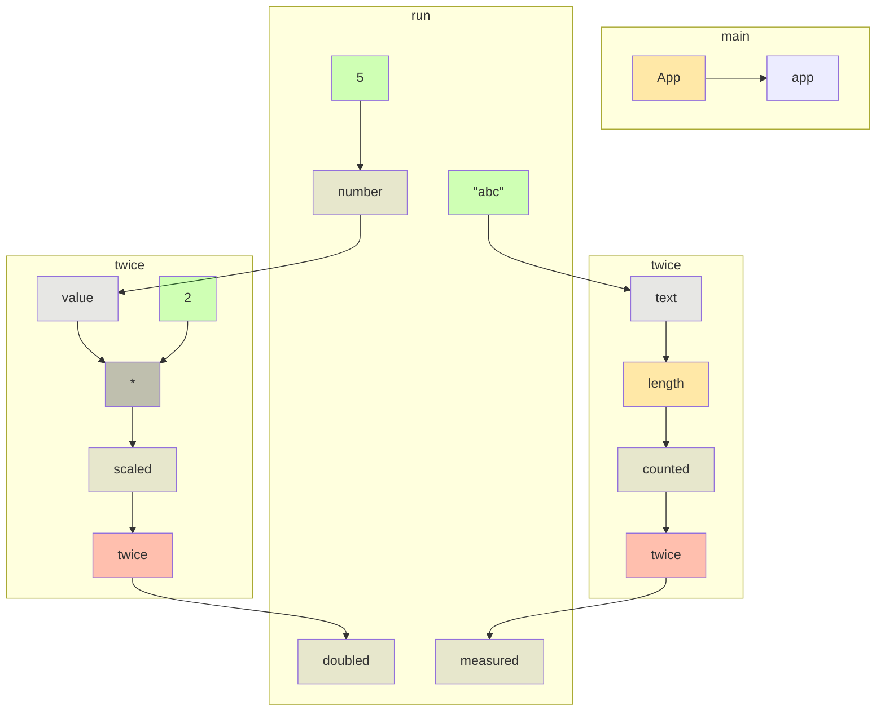

# overload: spike value graph (condensed)

```mermaid
flowchart TD
  subgraph m0["main"]
    n0["App"]:::EXTERNAL
    n1["app"]:::OBJ_VARIABLE
  end
  subgraph m1["run"]
    n2["#quot;abc#quot;"]:::LITERAL
    n3["5"]:::LITERAL
    n4["doubled"]:::VARIABLE
    n5["measured"]:::VARIABLE
    n6["number"]:::VARIABLE
  end
  subgraph m2["twice"]
    n7["length"]:::EXTERNAL
    n8["text"]:::FUNC_PARAM
    n9["twice"]:::RETURN
    n10["counted"]:::VARIABLE
  end
  subgraph m3["twice"]
    n11["*"]:::BIN_OP
    n12["value"]:::FUNC_PARAM
    n13["2"]:::LITERAL
    n14["twice"]:::RETURN
    n15["scaled"]:::VARIABLE
  end
  n0 --> n1
  n10 --> n9
  n11 --> n15
  n12 --> n11
  n13 --> n11
  n14 --> n4
  n15 --> n14
  n2 --> n8
  n3 --> n6
  n6 --> n12
  n7 --> n10
  n8 --> n7
  n9 --> n5
  classDef LITERAL fill:#00FF0030
  classDef VARIABLE fill:#80808030
  classDef BIN_OP fill:#80808080
  classDef FUNC_PARAM fill:#8080FF30
  classDef RETURN fill:#FF808080
  classDef EXTERNAL fill:#FFA50040
  classDef UNMODELLED fill:#FF000030,stroke-dasharray: 4 2
```
