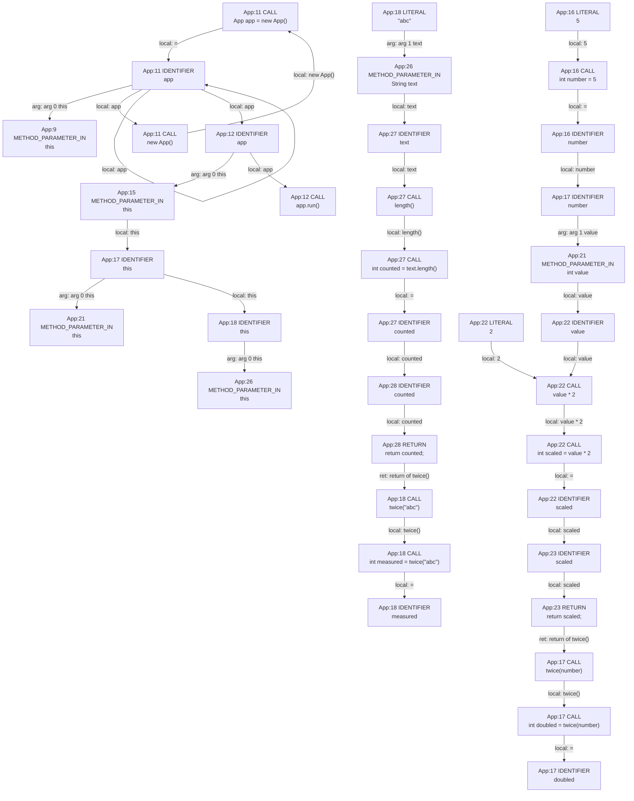

# overload: spike value graph

```mermaid
flowchart TD
  n0["App:11 CALL<br/>App app = new App()"]
  n1["App:11 CALL<br/>new App()"]
  n2["App:11 IDENTIFIER<br/>app"]
  n3["App:12 CALL<br/>app.run()"]
  n4["App:12 IDENTIFIER<br/>app"]
  n5["App:15 METHOD_PARAMETER_IN<br/>this"]
  n6["App:16 CALL<br/>int number = 5"]
  n7["App:16 IDENTIFIER<br/>number"]
  n8["App:16 LITERAL<br/>5"]
  n9["App:17 CALL<br/>int doubled = twice(number)"]
  n10["App:17 CALL<br/>twice(number)"]
  n11["App:17 IDENTIFIER<br/>doubled"]
  n12["App:17 IDENTIFIER<br/>number"]
  n13["App:17 IDENTIFIER<br/>this"]
  n14["App:18 CALL<br/>int measured = twice(#quot;abc#quot;)"]
  n15["App:18 CALL<br/>twice(#quot;abc#quot;)"]
  n16["App:18 IDENTIFIER<br/>measured"]
  n17["App:18 IDENTIFIER<br/>this"]
  n18["App:18 LITERAL<br/>#quot;abc#quot;"]
  n19["App:21 METHOD_PARAMETER_IN<br/>int value"]
  n20["App:21 METHOD_PARAMETER_IN<br/>this"]
  n21["App:22 CALL<br/>int scaled = value * 2"]
  n22["App:22 CALL<br/>value * 2"]
  n23["App:22 IDENTIFIER<br/>scaled"]
  n24["App:22 IDENTIFIER<br/>value"]
  n25["App:22 LITERAL<br/>2"]
  n26["App:23 IDENTIFIER<br/>scaled"]
  n27["App:23 RETURN<br/>return scaled;"]
  n28["App:26 METHOD_PARAMETER_IN<br/>String text"]
  n29["App:26 METHOD_PARAMETER_IN<br/>this"]
  n30["App:27 CALL<br/>int counted = text.length()"]
  n31["App:27 CALL<br/>length()"]
  n32["App:27 IDENTIFIER<br/>counted"]
  n33["App:27 IDENTIFIER<br/>text"]
  n34["App:28 IDENTIFIER<br/>counted"]
  n35["App:28 RETURN<br/>return counted;"]
  n36["App:9 METHOD_PARAMETER_IN<br/>this"]
  n0 -->|"local: ="| n2
  n1 -->|"local: new App()"| n0
  n10 -->|"local: twice()"| n9
  n12 -->|"arg: arg 1 value"| n19
  n13 -->|"arg: arg 0 this"| n20
  n13 -->|"local: this"| n17
  n14 -->|"local: ="| n16
  n15 -->|"local: twice()"| n14
  n17 -->|"arg: arg 0 this"| n29
  n18 -->|"arg: arg 1 text"| n28
  n19 -->|"local: value"| n24
  n2 -->|"arg: arg 0 this"| n36
  n2 -->|"local: app"| n1
  n2 -->|"local: app"| n2
  n2 -->|"local: app"| n4
  n21 -->|"local: ="| n23
  n22 -->|"local: value * 2"| n21
  n23 -->|"local: scaled"| n26
  n24 -->|"local: value"| n22
  n25 -->|"local: 2"| n22
  n26 -->|"local: scaled"| n27
  n27 -->|"ret: return of twice()"| n10
  n28 -->|"local: text"| n33
  n30 -->|"local: ="| n32
  n31 -->|"local: length()"| n30
  n32 -->|"local: counted"| n34
  n33 -->|"local: text"| n31
  n34 -->|"local: counted"| n35
  n35 -->|"ret: return of twice()"| n15
  n4 -->|"arg: arg 0 this"| n5
  n4 -->|"local: app"| n3
  n5 -->|"local: this"| n13
  n6 -->|"local: ="| n7
  n7 -->|"local: number"| n12
  n8 -->|"local: 5"| n6
  n9 -->|"local: ="| n11
```
