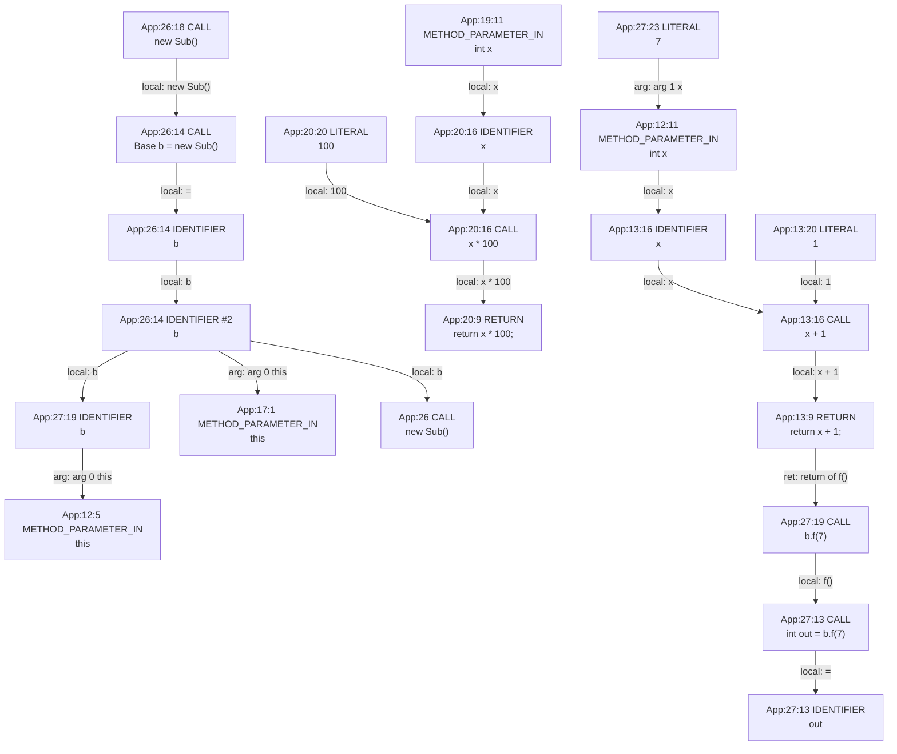

# overriddenMethod: spike value graph

```mermaid
flowchart TD
  n0["App:12:11 METHOD_PARAMETER_IN<br/>int x"]
  n1["App:12:5 METHOD_PARAMETER_IN<br/>this"]
  n2["App:13:16 CALL<br/>x + 1"]
  n3["App:13:16 IDENTIFIER<br/>x"]
  n4["App:13:20 LITERAL<br/>1"]
  n5["App:13:9 RETURN<br/>return x + 1;"]
  n6["App:17:1 METHOD_PARAMETER_IN<br/>this"]
  n7["App:19:11 METHOD_PARAMETER_IN<br/>int x"]
  n8["App:20:16 CALL<br/>x * 100"]
  n9["App:20:16 IDENTIFIER<br/>x"]
  n10["App:20:20 LITERAL<br/>100"]
  n11["App:20:9 RETURN<br/>return x * 100;"]
  n12["App:26 CALL<br/>new Sub()"]
  n13["App:26:14 CALL<br/>Base b = new Sub()"]
  n14["App:26:14 IDENTIFIER #2<br/>b"]
  n15["App:26:14 IDENTIFIER<br/>b"]
  n16["App:26:18 CALL<br/>new Sub()"]
  n17["App:27:13 CALL<br/>int out = b.f(7)"]
  n18["App:27:13 IDENTIFIER<br/>out"]
  n19["App:27:19 CALL<br/>b.f(7)"]
  n20["App:27:19 IDENTIFIER<br/>b"]
  n21["App:27:23 LITERAL<br/>7"]
  n0 -->|"local: x"| n3
  n10 -->|"local: 100"| n8
  n13 -->|"local: ="| n15
  n14 -->|"arg: arg 0 this"| n6
  n14 -->|"local: b"| n12
  n14 -->|"local: b"| n20
  n15 -->|"local: b"| n14
  n16 -->|"local: new Sub()"| n13
  n17 -->|"local: ="| n18
  n19 -->|"local: f()"| n17
  n2 -->|"local: x + 1"| n5
  n20 -->|"arg: arg 0 this"| n1
  n21 -->|"arg: arg 1 x"| n0
  n3 -->|"local: x"| n2
  n4 -->|"local: 1"| n2
  n5 -->|"ret: return of f()"| n19
  n7 -->|"local: x"| n9
  n8 -->|"local: x * 100"| n11
  n9 -->|"local: x"| n8
```
